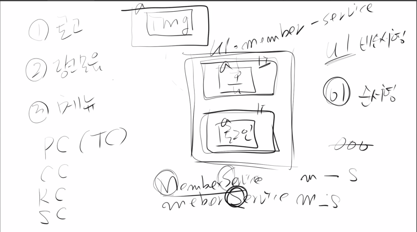

## 웹접근성과 웹표준

## 첫 번째 시간

### 수업의 방향성
- 중요한 베이스와 포인트를 알려주면 스스로 채워나가는 방향으로 수업 예정.
예를 들어, 프레임워크와 라이브러리의 차이는 무엇인가? 를 물어보면 스스로 알아내가는 과정이 필요함.
- 기술의 등장 배경에 대해서도 알아두는 것을 추천.
- 강사님 깃허브 PDF repo.에서 참고 자료들 있음.

### Internet Service
- 과거 구분되어 제공되던 인터넷 서비스들이 웹(WWW)으로 흡수통합되어 제공되고 있음. 자료의 이동을 목적으로 웹을 발전시켜왔는데, 이것을 통해 사용자와 사용자를 연결시켜 사용하면서 더 빠른 발전과 확장을 이뤄왔음.    

### WEB 의 설정값
- HTML : 건강한 신체를 만드는 역할. 이를 잘 활용하여 견고한 설계를 해야함. 버튼을 버튼 태그를 사용해 만들지 않고 버튼처럼 보이게 하는 것은 HTML을 제대로 활용하는 것이 아님. `div` 을 이용하면 접근성을 위해 추가적인 작업이 필요하게 된다.
- CSS : 근사한 스타일링. 문법에 대한 이해가 바탕되어야 적절하게 사용할 수 있음.
- JS : 스마트한 두뇌.

### 웹 표준
- W3C
- 브라우저 밴더가 표준이 아닌 것을 만들어내면 W3C 가 그것을 표준화시켜 만들어내는 것이 요즘의 트렌드. 이런 것을 스스로 찾아보고 정리하는 것이 기술 탄생의 배경과 트렌드를 이해하는데 도움이 됨.
- '제프리 젤드만 - 웹표준 가이드' 라는 책이 이러한 측면에서 역사와 배경을 알아보는데 도움이 될듯.

### 웹 접근성
- 좋은 개발자란 내가 만든 서비스를 사용자가 편하게 사용할 수 있게 만드는 사람. 개발을 편하게 하기 보다 내가 고생해서 사용자가 불편하지 않도록 하는 것이 좋은 개발자가 하는 일.
- 비단 내가 개발한 서비스가 장애인만을 위한 것이 아니라, 비장애인에게도 유용할 수 있다는 것을 염두에 둘 필요가 있음. 
- 내가 뭘 덧붙이면 사용자를 편하게 만들 수 있을까를 항상 고민해야 함.

  #### 장애에 대한 이해
  - 시각 장애 : 전맹, 전시력
  - 청각 장애 : 선천적 청각 장애일 경우 자막은 외국어와 같이 느껴질 수 있음. 수화가 더 친숙하게 느껴짐. 
  - 지체 장애 : 절단 및 지체기능 장애
  - 뇌병변 장애
  - 모든 장애를 커버하며 서비스 개발을 하는 것은 불가능에 가까움. 선택적으로 개발해야 함.
  - 장애는 무언가를 할 수 없는 것이 아니라 방법이 다를 뿐이다 라는 인식을 가지고, 다른 방법을 고려한 그들을 위한 서비스 개발에 초점을 두면 웹 접근성이 좋은 서비스 개발에 도움이 될 수 있다.

  #### 환경에 대한 이해
  - 다양한 플랫폼
  - 크로스 브라우징
  - SEO
  - 저사용 또는 저속회선

### 첫 시간을 마무리하며
- 차별은 분노를 유발할 수 있음.
- 이미 접근성을 고려해 나온 마크업을 잘 사용하면, 접근성을 위해 추가적인 작업을 하지 않아도 된다. 따라서 마크업을 잘 이해하고 적절하게 사용하는 것이 웹 접근성을 위해서도 중요하다.
- 웹 접근성은 더이상 선택이 아닌 필수다. 자연스럽게 개발 과정에 녹아들어야 한다.

## 두 번째 시간
- 우리 수업중 파이어폭스로 크로스 브라우징 필요.
- 윈도우 유저라면 IE도 크로스 브라우징 체크.

### 익스텐션
- 깃허브 intro repo. 에서 추천하는 크롬 익스텐션 설치
- seulbinum.github.io/webCafe 는 수업을 위해 만든 웹페이지
해당 페이지를 IEtab이라는 익스텐션으로 접속하면 맥 유저에게 IE 크로스 체킹하는 데 도움. 위 주소의 수업용 페이지를 IEtab으로 접속하면 플렉스 박스가 IE11에 적용되지 않기 때문에 UI가 무너짐
- vis bug와 같은 익스텐션을 사용하면 내가 가고 싶은 기업의 페이지를 클로닝하며 UI 분석할 때 도움이 됨.

### HTML 마크업
- HTML pdf에서 역사와 탄생배경에 대해서는 설명해 주지만 문법적인 부분은 스스로 찾아서 공부해야 함. 큰 크림을 이해해야 기술의 이해가 쉬워진다.
- HTML5 이전의 표준은 HTML 4.01, XHTML 1.1이고 여전히 지금도 표준이다. HTML5는 최신의 표준.
- 이전의 표준들에 대한 이해가 있어야 최신의 표준을 잘 사용할 수 있다. 서비스의 크기가 큰 기업일수록 보수적인데, babel과 같은 translator를 100% 신뢰할 수 없기 때문.
- HTML5 이전까지 과도기에 다양한 써드파티(비표준 기술) 툴이 난립했음. RIA의 출현
- RIA(Rich Internet Application) : flash, silverlight 등 플러그인 기반 기술들.
- XHTML : extensible HTML. XML을 사용해 확장성을 위한 HTML. 
- XML : 데이터를 주고받기 위한 표준. 확장성을 가지고 있음.
- 기존 HTML은 문법적으로 느슨한 부분이 있음. 3.2 버전에서 스타일 태그의 등장으로 룰셋이 많이 망가졌음. XHTML은 이러한 룰셋 보정의 목적도 지니고 있음.
- HTML5부터는 JS 관련 API를 기본적으로 제공해주게 되었음. ex) GeoLocation etc (pdf 18~22p : HTML API)
- HTML5부터는 렌더링 종류(inline, block)보다는 어떤 콘텐츠를 보여줄지가 중요하게 됐음. (pdf 5p: 콘텐츠 모델)
- 5이전 과거는 암묵적인 방식으로 사용했음. (pdf 17p: 아웃라인 알고리즘) 드랍된 개념인가? 로그인페이지에서도 로고에 h1을 사용하는 것도 이것과 관련된 관점의 사용인가?
- HTML5는 이전의 표준도 허용함. 따라서 규칙을 명확히 하지않으면 여러 표준이 섞여버릴 수 있음.
- 나만의 명확한 코딩 컨벤션이 필요함. (pdf 28~34p)
- React는 XHTML 사용을 추천함. 왜? XML과 JavaScript가 결합된 형태의 JSX를 사용.
- MDN도 100% 신뢰하면 안된다. 가장 좋은 것은 HTML 공식 문서. 리빙 스탠다드로 찾아봐야 함.

## 세 번째 시간
- 페이지 구분 3단, 4단 : 자유도는 4단이 더 높을 수 있음.
- 물론 3단에서도 헤더에 nav를 포함시키거나 비주얼 영역을 메인 컨텐츠 위에 추가할 수도 있음. 3단을 베리에이션해서 5단으로 구성.
- 컨텐츠 관점으로 구분을 시도해보면서 이후에 디자인 관점도 도입하는 것을 권장. 반복연습하며 두 가지의 장단을 느껴보면 좋을듯.

### Structure

- 페이지 전체를 하나의 컨테이너로 감싸면 flex 를 사용하거나 전체적인 페이지 여백 등을 조절하기 용이하다.
- 가급적 id 속성을 사용하지 않는 것이 좋다. 특정도가 높아져 재정의나 유지보수가 힘듦. 따라서 class 추천.
- id 는 form 태그나 **WAI-ARIA**(접근성 관련 스택) 를 사용할 때 꼭 필요한 속성이다.
- main 태그와 달리 header 태그는 여러번 사용할 수 있다. 메인 섹션에서 사용하면 메인 섹션의 header가 된다. class를 통한 적절한 네이밍을 하면 된다.
- 현업에서는 header 의 사용보다 div를 많이 사용하나, **WAI-ARIA** 관점에서는 header를 사용하는 것이 보조기기 사용시 탐색이 용이하다는 장점이 있다.
- `div` 를 사용할 경우  `role = "banner"`를 사용해야만 header의 역할할 수 있게 된다. (추가 작업이 필요하게 된다.)
- 우리의 예제에서는 navigation을 헤더에 포함시킴. 이럴 때 아래와 같은 클래스 네이밍을 고려해 볼 수 있다.
- gnb : global navigation bar
- lnb : local navigation bar
- section 과 article 의 사용에 대해 의견이 분분함. 
- 브라우저가 제공하는 기본적인 스타일 규칙을 **agent style**이라고 함.

### Header

- 헤더에 로고가 가운데 있고, 양쪽으로 네비게이션이 나눠져 있는 경우, 디자인 베이스로 구조를 설계하면 nav 태그를 두 개 사용하게 될 수도 있다. 그럴 필요없이 css를 이용해 하나의 nav를 나눠서 배치하면 된다.
- 로고 -> 링크모음 -> 메뉴 순으로 배치하는 것에도 이유가 있음.
로그인을 해야 다른 링크로 접근할 수 있다면 로그인을 먼저 마크업 해야 함.

- 점진적인 향상(progressive enhancement) : 필수적인 콘텐츠와 기능과 같이 베이스가 되는 것부터 만들고, 필요한 기능들을 추가하는 것.
https://developer.mozilla.org/ko/docs/Glossary/Progressive_Enhancement
이것을 확인해볼 수 있는 것은 지메일로 들어가 Web developer 익스텐션에서 JS를 disable 해도 기본적인 기능인 메일 보내기 받기와 같은 필수적인 기능은 잘 작동한다.
- 어떤 이미지를 image 태그로 넣을 수 있고, css background로도 넣을 수 있다. 상황에 따라 어떤 방법이 좋을지가 달라질 수 있다. 내가 사용해 보면서 어떤 상황에 어떤 방법이 적절했는지를 기록해놓는 것을 추천. 뷰포트 크기에 따른 반응형 이미지의 경우 css를 활용한 방법이 더 효율적이다. 여러 이미지를 sprite를 사용해 뿌릴 수 있다. svg 이미지는 또 다른 방식이 필요하다.
http://tcpschool.com/css/css_basic_imageSprites
- 시안을 바탕으로 없던 것을 개발하는 것이 우리가 하는 일. 링크모음의 글자를 이미지로 가져가 복사 붙여넣기 하는 것이 아닌 text로 가져가서 시안과 동일하게 만드는 것이 우리의 일이다.
- 클래스를 활용한 태그 네이밍 테크닉
파스칼 케이스 : MemberService
카멜케이스 : memberService
케밥케이스 : member-service
스네이크케이스 : member_service
- 로고에 heading 태그를 사용하지 않는다면 main 태그에서 heading을 사용해도 된다. 꼭 로고에 heading 태그를 사용할 필요는 없다. 다른 태그가 선행되어야 할 경우에는 로고에 heading 태그를 사용할 수 없는 경우도 있기 때문.
- 대체텍스트는 놓치기 쉬우나, 한 번 놓치면 치명적임.
- 단순히 '로고'라는 단어를 대체텍스트로 사용하면 아무 의미가 없음. 어떤 페이지의 로고인지를 알 수 있게 작성해야한다.

### CSS
- css 를 잘하려면 처음 짠 마크업을 건드리지 않는 조건으로 계속 사용해보는 것을 추천.
- css basic box model
https://developer.mozilla.org/ko/docs/Web/CSS/CSS_Box_Model/Introduction_to_the_CSS_box_model
- margin 은 보이지 않을뿐 박스의 사이즈에 포함된다고 이해해야 한다. 개발자 도구의 basic box model을 보면 알 수 있음. (margin의 특성)
margin-inline: 글자가 흘러가는 방향축의 개념을 사용. 기본적인 텍스트는 좌우이므로 margin도 좌우로. 축이 바뀌면 위아래로 바뀐다. padding 도 이러한 개념이 적용되는 속성이 있다. 이와 관련한 내용을 스스로 찾아서 공부해야 함.
https://css-tricks.com/almanac/properties/m/margin-inline/
- box-sizing : border-box 에는 margin은 포함되지 않는다.
- CSS2에서는 가상요소 선택자와 가상 클래스 선택자가 `:`로 동일하게 사용. CSS3에 와서 `::`로 구분지어 사용.
- 사실 CSS 버전은 마케팅적인 요소다. selector 등이 모듈 단위로 개발되기 때문에 아직 모듈 1도 있을 수 있다.
- 'flexbox css tricks' 로 구글 검색했을 때 최상단 페이지 레퍼런스로 보면 좋음.
https://css-tricks.com/snippets/css/a-guide-to-flexbox/
- flex item이 되는 요소에 flex-basis(%단위)로 크기를 나눠 배분할 수 있으나, 현업에서는 직관적으로 width 사용하는듯.
- `justify-content: space-evenly` 는 IE11 에서 호환 불가. 따라서 space-between과 padding을 섞어 사용하면 크로스 브라우징이 가능하다.
- 모든 flex item의 order는 0이다. 같을 경우 먼저 마크업이 된게 선 순서를 갖는다.
유저의 커스텀 배치를 가능하게 하려면 CSS order의 속성을 잘 이해하고 있어야 한다.
- 내일은 float 배울 예정
- 내가 알고있는 float과 flex 지식을 활용해 미리 공부해보면 도움이 될듯.