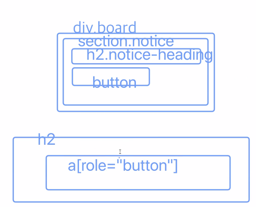
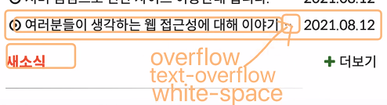

## 첫 번째 시간
**수업 시작전**
- SASS 강좌 수강하기. 이번주 반응형 마무리. 다음주에 SASS 나갈 예정. 따라서 선행학습측면에서 공부.
- 웹 접근성 지침에 대해 시험을 낼 수도 있을듯. 다시 한 번 살펴보기.

- 입사해서 접근성에 대해 어필하면 불편하게 느낄 수도 있다. 아직까지는 실무와 동떨어진 느낌이 있기 때문인듯. 팀과의 조화, 균형을 이루는게 우선. 이후에 접근성에 대해 의견을 **제시**해 볼 수 있을것.

- 코드에 대해서도 가독성이 떨어질 수 있는데, 그 부분을 발표 자료 구성할 때 고려해야 할 부분.

- 다른 조의 의견, 자료 전달 방식이 좋다면 차용해서 다음 발표에 활용해 볼 수 있을듯.

- 가장 좋은 PT는 대비를 주는 것. before, after를 활용하는 것이 잘 모르는 사람에게 전달하기 좋을 수 있다.

**실습**

**공지사항/자료실 탭 게시판**

아래와 같은 마크업 순서가 좀 더 논리적인 방식이지 않을까?
- 공지사항 탭 -> 공지사항 내용 -> 더보기 -> 자료실 탭 -> 자료실 내용 -> 더보기

**focus 관련**
- a 태그가 href 값을 가지고 있어야 탭으로 포커스 받을 수 있음.
- 다른 네이티브로 초점을 받을 수 있는 요소들도 href 값을 가지고 있어야 함.
- `tabindex` 속성값으로 강제로 포커스를 가져올 수도 있음.
- 다만 이럴경우 엔터, 스페이스를 눌렀을 때 어떤 이벤트를 실행하게 만들려면 JS가 필요하다.

**heading & button**

- 따라서 포커스 받는 요소를 버튼 요소로 구성하거나 WAI-ARIA 의 `role="button"` 를 고려해볼 수 있다. 그러나 h2와 같은 요소에 버튼을 삽입하게 되면 제목이 버튼이라는 의미적으로 언매치가 발생할 수 있다.
- h2 를 숨김 콘텐츠로, 따로 button 요소를 구성해서 마크업하는 것을 고려할 수 있다. 
- 부모에 이벤트를 부여해서 자식에게 상속시키는 방법도 고려해볼 수 있다.
- `.is-active` 와 같은 클래스 네이밍을 자신만의 컨벤션으로 사용해서 동적인 요소에 부여해서 가독성 측면을 고려하는 것도 좋은 습관이 될 수 있다.

**더보기 button**

- `datetime=""` 기계가 인식할 수 있는 날짜체계 속성. 스크립트로 날짜 관련 연산을 할 때 유용할 수 있음.

- a 태그에 설명을 위한 요소로 타이틀 속성값을 주는 것은 조금 옛날 방식. aria 를 활용하는 것이 좀 더 팬시하다.

**`aria-describedby` & `aria-labelledby`**

`aria-describedby`
- `aria-labelledby`의 기능과 유사합니다. 레이블은 객체가 수행하는 작업의 본질을 사용자에게 제공하는 반면, 설명(description)은 일부 사용자에게 필요할 수 있는 추가 세부사항을 제공하기 위한 것입니다.
- `aria-describedby`가 사용된 요소는 전체적인 설명으로 구성됩니다. 필요한 경우 여러 요소에 대한 ID 참조를 포함하거나 ID가 참조하는 요소와 함께 요소 집합(예: 단락)을 포함합니다.

`aria-labelledby`
- `aria-label`과 사용목적은 동일합니다. 객체의 인식가능한 이름을 사용자에게 제공하기 위함입니다.
- 만약 레이블 텍스트가 화면에 보여야 한다면 `aria-label`가 아닌 `aria-labelledby`를 써야합니다. `aria-label`은 인터페이스가 화면에 보이는 레이블을 가질 수 없는 경우에만 사용합니다.
- 사용자 에이전트는 액세스 가능한 이름 속성을 계산할 때 `aria-label` 보다 `aria-labelledby`를 우선시합니다.

### 관련 내용 참조 링크
https://developer.mozilla.org/en-US/docs/Web/Accessibility/ARIA/ARIA_Techniques/Using_the_aria-describedby_attribute

- 폰텔로나 폰트어썸은 `aria-hidden` 을 주지 않아도 된다. 역슬래쉬 뒤의 텍스트를 스크린 리더가 어차피 읽지 못하기 때문. 하나의 트릭.




**`text-overflow`**
- overflow 콘텐츠가 사용자에게 보여지는 방법을 설정합니다. 자르거나 말줄임표(ellipsis)를 표시하거나, 사용자 지정 문자열을 표시할 수 있습니다.
- overflow가 발생하도록 강제하지 않습니다. 컨테이너의 텍스트를 overflow 하려면 아래와 같은 CSS 속성을 설정해야 합니다.
```css
overflow: hidden;
white-space: nowrap;
```
- `text-overflow` 속성은 블록 요소를 인라인 진행 방향으로 overflow하는 내용에만 영향을 줍니다.
- `text-overflow` 속성에는 하나 또는 두 개의 값을 지정할 수 있습니다. 값이 하나 지정된 경우, 텍스트 진행방향이 왼쪽에서 오른쪽이라면 오른쪽 끝, 오른쪽에서 왼쪽이라면 왼쪽 끝, 이렇게 둘 중에 한 쪽 끝에 대한 overflow 동작을 지정합니다. 두 값이 지정된 경우, 첫 번째 값은 왼쪽 끝, 두 번째 값은 오른쪽 끝에 overflow 동작을 지정합니다.

**`clip`** <br>
- default value 입니다. 컨텐트 영역의 끝에서 텍스트를 자릅니다. 따라서 문자(character) 중간에 절단이 발생할 수 있습니다.

**`ellipsis`**
- 잘려진 텍스트를 말줄임표(ellipsis)로 표시합니다. 말줄임표는 내용 영역 내에 표시되어 표시되는 텍스트 양을 줄이게 됩니다. 말줄임표를 표시할 공간이 충분치 않을경우 잘려서 표시됩니다.

### 관련 내용 참조 링크
https://developer.mozilla.org/en-US/docs/Web/CSS/text-overflow

<hr>

## 세 번째 시간
- github.com/NIAWA 에 ARIA repo.에 정보접근성(WAI-ARIA) 사례집 내부 코드들 있음.
- 사례집에 mega-navigation 관련 내용 있나 확인 필요

- WAI-ARIA best practices 구글링해보면 W3.org 에 참고할만한 자료 있음.
    https://www.w3.org/TR/wai-aria-practices-1.1/
    - 키보드 인터랙션 관련 조건들도 명시되어 있음.

<hr>

## 과제 발표 피드백
- 같은 통계자료를 제시했더라도 전달 방식에 따라 전달의 효율성이 달라질 수 있음을 인지하고 있어야 함.
- 인식의 용이성에서 검사항목 중 목적 기능(Level AAA)은 어떤 이미지가 기능을 가지고 있는데도 불구하고 대체텍스트가 그것을 제대로 설명하지 못하고 있을 때 위반 사례로 판단 가능함. 기능이 없는 단순 아이콘인 경우에는 위반 사례로 보기는 어려움. 아래의 러닝 가이드 참고.

- WCAG 2.1 러닝 가이드
https://www.youtube.com/playlist?list=PLtaz5vK7MbK1bAGhAFkidBzIRVrNqVo5j

- 레이어 팝업 문제에 대한 개선 방안은 아래의 링크 영상 참조
https://www.youtube.com/watch?v=gShGtS4YLiw
