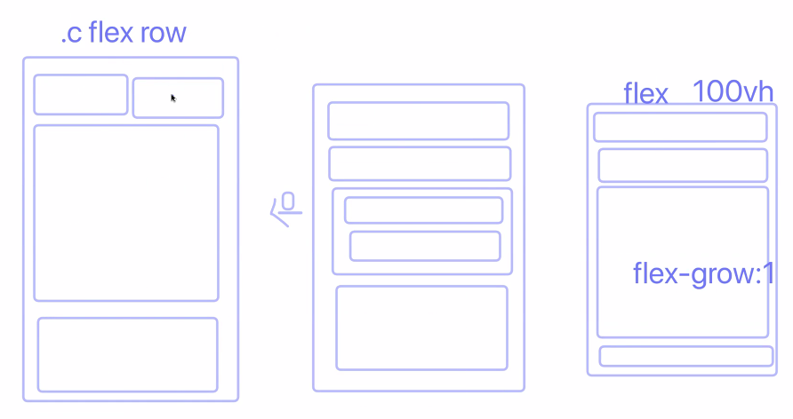
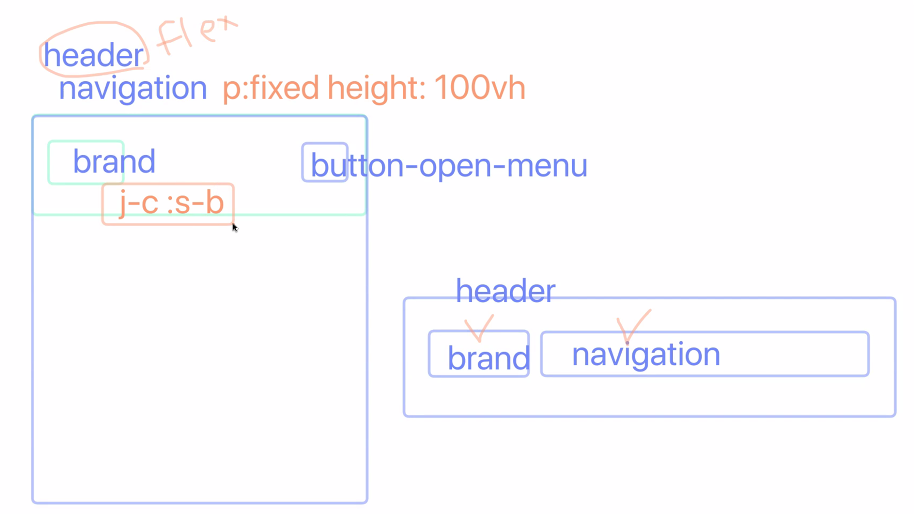

<!--  -->

## 첫 번째 시간
- 과제 문법 오류 체크 안했나?
- HTML이 잘못된 방향으로 가면 JS, React가 어려워진다.
- 접근성 관점에서 페이지의 타이틀은 페이지의 내용을 이해할 수 있는 유니크한 내용을 작성해야 함.

- aside는 삭제되어도 main 내용 이해에 영향을 주지 않는 컨텐츠. 그런 컨텐츠를 삽입해야 한다.

- 바디 안의 요소 전체를 감싸고 있는 컨테이너에 max-width 를 1280px로 줘서 해당 너비를 벗어나지 않고 디스플레이 할 수 있다. ???

- css 변수와 Sass 변수 사용법은 다르다. Sass 는 `$`, css 는 `--`를 사용함. css 변수는 전역으로 사용할 수밖에 없는데(?) 이것이 장점이자 단점.

- css는 url을 직접 지정해 import. Sass 와는 import방식이 다름

**reponsive web design break point**
- reponsive web design break point(max-width 선정을 위한) 찾아서 알아보기. 국내와 해외의 기준이 다를 수 있음. 

- break point를 적절히 지정해야(max 또는 min) 함.

- 반응형은 간단한 UI에 적용하기 수월함. 복잡해질수록 어려워짐.

- 컨테이너를 중앙에 배치하기 위해 flex를 또 사용하려고 하기보다 flex의 auto margin 특성을 활용해 중앙에 배치. 음수 마진도 적절히 활용하면 유연함을 가져갈 수 있음.

**img 요소**

- 비트맵은 원본 크기보다 커지면 화질이 깨지므로 max-width를 걸어준다. svg는 width 100% 걸어줘도 됨.

-.webp는 IE에서 지원 안하는 이미지 확장자. img 태그의 소스 속성 srcset에는 지원하는 브라우저에서 보여줄 이미지, src는 그렇지 않은 브라우저에서 보여줄 이미지. 반응형 이미지 제공의 기본이다. 마크업에 모든 이미지 소스를 직접 입력하지 않아도 된다. 모아서 컴포넌트 형태로 뿌려주면 됨.??
- 반응형 이미지 관련 MDN : https://developer.mozilla.org/ko/docs/Learn/HTML/Multimedia_and_embedding/Responsive_images

**mobile first 관련 mailing post**
- mobile first 관련 메일링 : https://ishadeed.com/article/the-state-of-mobile-first-and-desktop-first/

<hr>

## 두 번째 시간

**picture 요소**
- picture는 자식요소로 0개 이상의 source 태그를 포함하고 있고, 여러가지 디스플레이/디바이스 시나리오에서 대체적인 이미지를 제공하기 위해 img를 사용해야 함. source에 지정한 이미지들을 디스플레이 할 수 없는 경우(브라우저가 picture요소를 지원하지 않는다던지.. IE지원 안함) img 태그에 지정된 이미지를 보여주도록. 즉, img 태그가 제공하는 이미지는 fallback이다.
- svg, png 둘 다 export해서, picture요소 사용시 svg를 지원하지 않는다면 png를 노출시키는 등의 유연한 방식을 사용해볼 수 있다.
- 위와 관련된 내용 MDN : https://developer.mozilla.org/en-US/docs/Web/HTML/Element/picture
- 이미지 소스 뒤에는 이미지의 디스플레이 배율을 의미.
```css
    <figure>
        <picture>
            <source srcset="./images/banner-narrow.jpg 1x,
                         ./images/banner-narrow@2x.jpg 2x" />
            
        </picture>
    </figure>
```
**mydevice.io : 사용자의 디바이스 화면 px을 알려줌**
- https://www.mydevice.io/


**picture polyfill**
https://github.com/scottjehl/picturefill 
위의 것을 사용할 거라면 srcset을 사용. src를 사용하면 보다 다양한 브라우저에서 이미지 제공 가능.

- figure 요소의 크기에 따라 반응형 이미지를 제공해야 한다면 picture 요소에 클래스를 주는게 아니라 img 요소에 줘야한다. 그리고 이것을 css에서 사용해야 한다.

**video 요소**
- 브라우저마다 지원하는 비디오 확장자가 다름. 크로스 브라우징 이슈가 있었다. 현재 대부분의 모던 브라우저는 .mp4를 공통적으로 지원함.
- 비디오 파일 제공시 접근성 관점에서 자막을 제공해줘야함.
- 비디오 태그는 소스를 감싸고 있고 클래스는 여기에 줄 수 있다. picture와 다른 점.

**iframe 요소**
- iframe 은 figure 요소 안에 바로 삽입하면 안된다. div로 감싸서
- iframe 요소의 title 속성보다 aria-label이 좀 더 접근성 측면에서 좋다. 해당 부분의 설명도 좀 더 의미있게 수정해볼 수 있다.
- iframe 형태로 유튜브에서 소스를 가져올 수 있는데, width와 height가 지정되어 있다. 16:9 로 제공됨.
- iframe을 감싸는 div 클래스에 `iframe16`, `iframe4` 등과 같은 클래스명을 줄 수 있는데, 화면 비율을 의미한다. `iframe4` 는 4:3 비율.
- fullsize 클래스를 이용해 현재 css 지정된 속성들로는 (height는 auto로만 지정되어 있으므로) 너비만 늘어나고 높이는 늘어나지 않는다. 아래와 같이 클래스를 구분해서 비율을 지정해 높이도 늘어나게 할 수 있다. 그러나 아래와 같은 방법도 직접 비율을 입력해줘야 하는데, 자동적으로 비율을 계산해 디스플레이 해주는 css 방식도 있다. `aspect-ratio`
```css
.iframe-container {
    width: 100%;
    height: 0;
    position: relative;
}

.iframe4 {
    padding-top: 75%;
}

.iframe16 {
    /* padding-top: 56.25%; */
}

.iframe-container iframe {
    position: absolute;
    top: 0;
    left: 0;
    width: 100%;
    height: 100%;
}
```
**iframe에서 화면비율을 위한 aspect-ratio**
- `aspect-ratio: [원하는 비율]`. 단, 이 때 iframe을 감싸는 `.iframe-container` div에 지정한 `height:0;` 을 auto로 줘야 함.
역시 IE 지원 안함.
https://developer.mozilla.org/en-US/docs/Web/CSS/aspect-ratio

<hr>

## 세 번째 시간


- X-UA-Compatible : 비표준(X)-useragent-호환성. IE 호환성을 위한 메타 태그

- `shortcut`은 옛날의 파비콘 제공 방식. 요즘은 icon만 사용. 기타 ios를 위한 rel 속성 값도 있음.
```html
 <link rel="shortcut icon" href="./images/favicon.ico" />
```
- header와 navigation이 분리 또는 합쳐질 수 있다. 고정관념 버리자.
- button에 대해 label에 button 이라는 명시적 설명을 하지 않도록.
- title보다 label, aria-label을 보조기기에서 우선 인식한다.
- 알파벳 x가 아닌 1:1 정비율을 쓰기 위한 곱하기 기호를 사용함으로써 스타일링이 좀 더 쉬워짐. (close button)
- `aria-hidden="true"`을 사용해 컨텐츠를 읽지 않도록

**normalize css cdn 파일 소스 코드 설명**
- 접근성 관점에서 한글의 경우 1.5를 권장함. 최소 1.2배. line-height 였던가?
- 미디어 쿼리의 오리엔테이션 제어. 포트레이트 방식, 랜드스케이프 방식. ios. normalize는 이렇게 모바일도 고려해서 normalize 해줌. 따라서 성능은 떨어질 수 있지만 일관성을 유지할 수 있음.


- height 또는 width를 100%를 쓰다는 것은 부모가 높이를 가져서 그것을 상속받아 백분율의 기준으로 사용한다는 의미. 따라서 부모 높이가 원하는 높이가 아닌 경우 vh를 사용한다.

- css import는 선언 순서대로 불러와져 cascading 된다.

<hr>

## 네 번째 시간


- `outline-offset: -2px;` padding만으로 header의 면적을 차지하게 하기 위해 마지막에 추가해 주는 속성. border와 마진 사이에 있는 여백을 의미함.

- `user-select: none;` 버튼 드래그 방지. 렌더 prefix를 붙여 사용하기도 함.
포스트 css같은 것을 사용하면 자동으로 붙여줌.

**bem class naming pattern**
- block, element, modifier naming convention : https://webflow.com/blog/class-naming-101-bem

- em, 백분율을 반응형 웹 디자인 작업에 많이 사용. 

- 시안의 이미지를 export 할 경우 여백을 포함해서 하면 경우에 따라 레이아웃이 편해질 수도 있다. 여백을 포함하지 않을 경우 아래와 같은 코드를 고려해 볼 수 있다.
```css
background-position: 50% 50%;
background-size: cover;
```
- 네비게이션 메뉴의 각 요소를 좌우는 마진을 주고, 상하만 패딩을 주는게 개발할 때도 사용성 측면에서도 좋다. margin은 패딩과 달리 클릭이 되지 않으므로.

<hr>

## 다섯 번째 시간
- css 변수로 색깔 이름을 변수로 사용하면 의미적으로나 색 구별이 어려울 수 있다. 기존의 변수 색을 의미적인 이름의 변수에 재할당 하거나 합성해서 사용하는 것을 고려해볼 수 있다.

- font는 다운로드 받아서 렌더링을 하기 때문에 먼저 임포트 하는게 좋음.

- form 관련 요소 (ex.button)를 작업할 때 글자 속성(color 등) 은 inherit 처리하고 진행하는 것이 좋다.