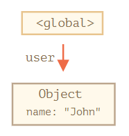
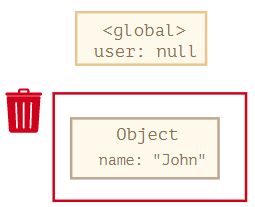
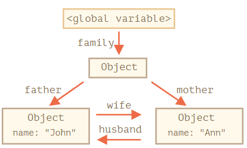
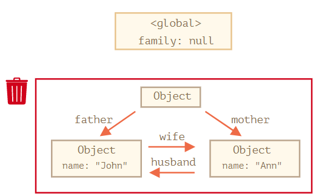
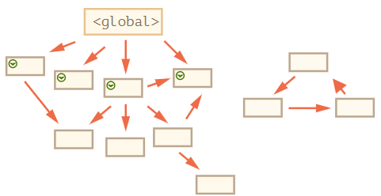
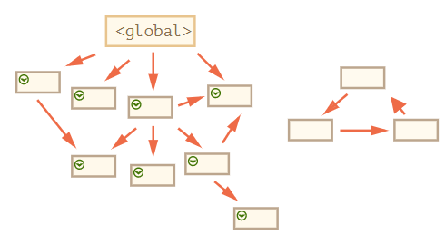
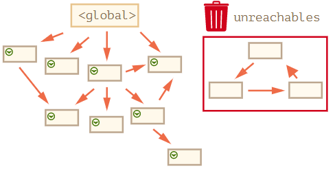

<!--  -->

우리가 만드는 모든 값은 메모리를 차지하고 필요없는 것은 사라집니다. Garbage Collector는 JavaScript 엔진 내에서 메모리의 필요없는 값을 삭제하여 메모리 관리를 수행하는 기능을 합니다.

메모리 관리 방식에 따라 Unmanaged language와 Managed language로 분류가 가능한데, JavaScript는 메모리 관리를 개발자에게 위임하지 않고 JavaScript 엔진이 보이지 않는 곳에서 Garbage Collection을 통해 메모리 관리를 수행하는 Managed language입니다.

그럼 JavaScript Garbage Collection의 대략적인 동작 방식에 대해 간단히 살펴보겠습니다.

## 변수 생애 주기

우리가 만드는 모든 값은 메모리를 차지하고 쓸모 없어진 것들을 Garbage Collector가 찾아내 삭제하게 됩니다. 쓸모 없어진다는 의미를 변수의 생애주기를 바탕으로 설명하면,

- 메모리 공간 확보 (Allocate memory)
- 사용 (Use memory)

  user 변수에 아래와 같은 객체를 할당하면 전역에서 user 변수를 통해 연결된 객체를 참조할 수 있고, 메모리 관점에서 메모리가 사용되고 있다고 볼 수 있습니다.

  ```js
  let user = {
    name: 'John',
  };
  ```

  <figure style = "display: block; text-align: center;">
    
    <figcaption style = "text-align: center; font-size: 12px; color: #808080">

  <출처 : [모던 JavaScript Tutorial](https://ko.javascript.info/garbage-collection)>

    </figcaption>

  </figure>

- 쓸모 없어진 값 해제 (Release memory)

  쓸모 없어진 값의 예는 아래와 같습니다. user 변수를 통해 객체가 더이상 참조되지 않기 때문에 객체는 쓸모 없어진 값이 되며, 메모리 관점에서 객체가 차지하고 있는 공간은 해제가 필요하게 됩니다.

  ```js
  let user = null;
  ```

  <figure style = "display: block; text-align: center;">
    
    <figcaption style = "text-align: center; font-size: 12px; color: #808080">

  <출처 : [모던 JavaScript Tutorial](https://ko.javascript.info/garbage-collection)>

    </figcaption>
    
  </figure>

쓸모 없어진 것을 판단하는 두 가지 기준 있고, 그 기준을 바탕으로 아래와 같은 알고리즘이 동작하여 Garbage Collection이 이루어집니다.

## Reference-Counting Algorithm

첫 번째는 가장 단순한 기준인 참조 여부입니다. 위의 변수 생애 주기 예시에서 봤듯이, 어떤 메모리의 값이 참조된다는 것은 사용된다는 것을 의미하고 이러한 값은 삭제되지 않습니다.

그러나 이렇게 단순히 참조여부를 기준으로 삭제 여부를 결정하는 것은 한계가 있습니다.

조금 복잡한 예시를 살펴보겠습니다. 아래 marry 함수는 객체 두 개를 인수로 받아 서로 참조하게 만들고, 두 객체를 포함하는 새로운 객체를 반환합니다.

```js
function marry(man, woman) {
  woman.husband = man;
  man.wife = woman;

  return {
    father: man,
    mother: woman,
  };
}

let family = marry(
  {
    name: 'John',
  },
  {
    name: 'Ann',
  },
);
```

<figure style = "display: block; text-align: center;">
  
  <figcaption style = "text-align: center; font-size: 12px; color: #808080">

<출처 : [모던 JavaScript Tutorial](https://ko.javascript.info/garbage-collection)>

  </figcaption>
  
</figure>

위의 그림에서 family에 null을 할당해 아무것도 참조하지 않도록 합니다. marry 함수에 의해 새롭게 생성된 객체와 함수 내부객체들은 서로를 참조하고 있고 이러한 참조를 순환참조라고 합니다. 사용되어지지 않고 있음에도 서로 참조하고 있기 때문에 Reference-Counting Algorithm은 해당 객체들을 삭제하지 않습니다.

```js
family = null;
```

<figure style = "display: block; text-align: center;">
  
  <figcaption style = "text-align: center; font-size: 12px; color: #808080">

<출처 : [모던 JavaScript Tutorial](https://ko.javascript.info/garbage-collection)>

  </figcaption>
  
</figure>

## Mark and Sweep Algorithm

쓸모없어진 것을 판단하는 두 번째 기준은 도달 가능성입니다. '도달 가능한(reachable)' 값은 사용할 수 있는 것은 물론이고, 어떻게든 접근할 수 있는 값을 의미합니다. 이렇게 도달 가능한 값은 삭제되지 않습니다. 도달 가능 여부는 전역변수와 같은 루트가 참조하는 값이나, 체이닝으로 루트에서 참조할 수 있는 값인지로 판단할 수 있습니다. 루트 값의 예시는 다음과 같습니다.

- 현재 함수의 지역 변수와 매개변수
- 중첩 함수의 체인에 있는 함수에서 사용되는 변수와 매개변수
- 전역 변수
- 기타

구체적인 프로세스를 아래와 그림과 함께 살펴보겠습니다. 첫 번째 단계에서 루트 정보를 수집하고 mark 해둡니다. 이후 루트가 참조하고 있는 모든 객체를 방문하고 이것들도 mark 해둡니다.

<figure style = "display: block; text-align: center;">
  
  <figcaption style = "text-align: center; font-size: 12px; color: #808080">

<출처 : [모던 JavaScript Tutorial](https://ko.javascript.info/garbage-collection)>

  </figcaption>
  
</figure>

도달 가능한 모든 객체를 모두 방문하며 mark 해둡니다. 오른쪽에는 루트로부터 도달할 수 없는 객체들이 존재합니다.

<figure style = "display: block; text-align: center;">
  
  <figcaption style = "text-align: center; font-size: 12px; color: #808080">

<출처 : [모던 JavaScript Tutorial](https://ko.javascript.info/garbage-collection)>

  </figcaption>
  
</figure>

도달할 수 없었던 객체는 메모리에서 삭제됩니다.

<figure style = "display: block; text-align: center;">
  
  <figcaption style = "text-align: center; font-size: 12px; color: #808080">

<출처 : [모던 JavaScript Tutorial](https://ko.javascript.info/garbage-collection)>

  </figcaption>
  
</figure>

이러한 루트로부터의 도달가능성 기준에 의해 Garbage Collection을 수행하면 루트 중 하나인 전역 변수의 경우 브라우저 환경에서 탭을 닫을 때까지 삭제되지 않을 수 있습니다.

따라서 메모리 관리의 효율측면에서 전역 변수의 사용은 남발하지 않는 것이 좋습니다.

## 최적화 기법

JavaScript 엔진은 위에서 설명한 알고리즘에 기반한 Garbage Collection 수행을 더 빠르게 하기 위해 아래와 같은 최적화 기법 사용합니다. 최적화 기법에 대한 자세한 설명은 참조 링크를 통해 살펴볼 수 있습니다.

- generational collection

- incremental collection

- idle-time collection

## 마치며..

JavaScript 엔진마다 구체적인 최적화 기법과 Garbage Collection Algorithm이 다를 수 있습니다. 이 이상의 심화학습은 엔진의 발전과 함께 성장하고 싶은게 아니라면 실질적인 효용은 없다고 생각합니다.

다만 클로저의 개념이해와 더불어 왜 클로저가 Garbage Collection의 대상이 아닌지에 대해 추가학습을 하는 것은 좀 더 폭 넓은 이해를 하는데 도움이 된다고 생각합니다.

## 참조 링크

- [모던 JavaScript Tutorial](https://ko.javascript.info/garbage-collection)
- [MDN JavaScript의 메모리관리](https://developer.mozilla.org/ko/docs/Web/JavaScript/Memory_Management)
