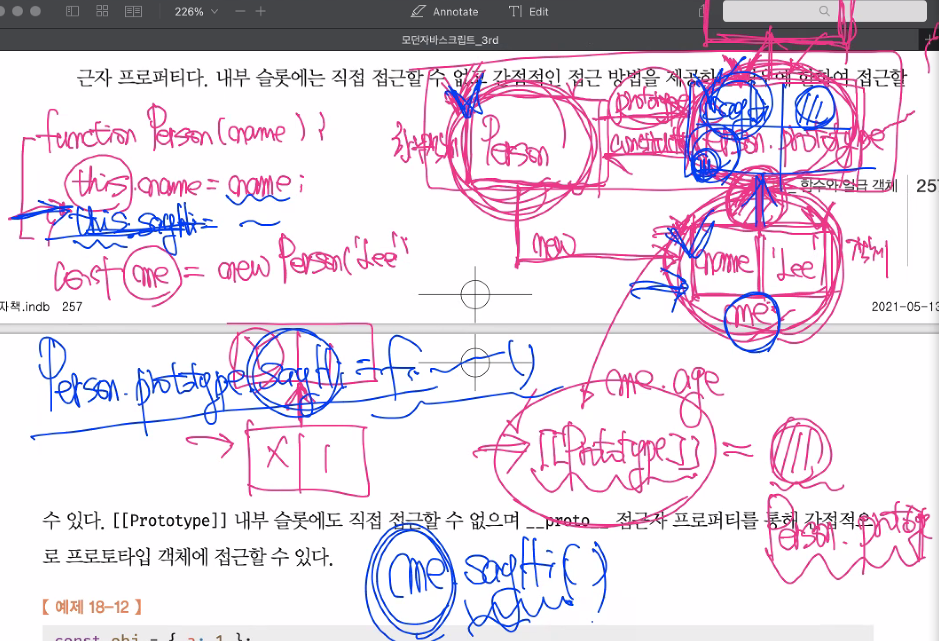

<!--  -->

## 첫 번째 시간

**NPM**

- NPM은 node package manager 이자 우리가 만드는 package를 저장할 수 있는 공간. 사용자입장과 배포하는 입장에 따라 다르게 해석될 수 있다.
- package.json은 사용자의 입장에서 의존성을 관리하기 위한 목적.
- `npm init -y` 에서 `-y`는 package.json의 모든 필드값을 디폴트 값으로 초기화해주는 옵션.
- name, version 필드는 반드시 있어야 하는 필드다.

**semantic versioning**

- Major, Minor, Patch 로 구성. 버그를 모아서 수정한 것은 Patch를 변경.
- 버그를 고치면서 새로운 기능을 추가해 성능 개선 등이 이루어진 것은 Minor를 변경.
- 브레이크 체인지가 발생했을 때는 Major를 변경. 브레이크 체인지는 이전 버전과 달라서 호환이 안될 수도 있는 변경이 이루어짐을 의미.
- 다른 프로그램을 사용할 때도 이러한 버전, 특히 Major 버전을 고려해서 사용해야 함. Major의 변경은 팀장급에서 의사결정을 해야할 부분. 반드시 그 버전을 사용해야 할 이유가 있을만한 기능이 해당 버전에 있어야 함.
- Major 앞에 `^`은 브레이크 체인지가 일어난 새로운 버전이 나온 상황에서, 업데이트 시 Major는 변경하지 않고 Minor의 최신 버전까지만 변경한다는 것을 의미.

**개발 의존성(devDependencies)과 의존성(dependencies) 차이**

- package install 시 `-D`는 개발 의존성.
- `-` 는 `-D`와 같은 축약형일 때 보통 사용.
  **과제?**
- poiemaweb의 Node.js의 1, 2번 읽어오기

- 환경설정에 의해 발생한 문제는 기록을 꼭 해두면 나중에 동일한 문제 발생시 도움이 될 수 있다.

- package.json은 팀장급들이 개발 환경을 세팅하는 명세라고 볼 수 있고, 따라서 한 명이 관리하여 배포하면 같은 프로젝트를 진행하는 사람들끼리 의존성 모듈(package)과 관련된 개발환경을 동일하게 가져갈 수 있음.

**네임스페이스 vs 스코프**

- 이름이라는 개념에는 식별자, 프로퍼티가 포함된다. 스코프도 식별자들을 구분하는 유효범위이므로(식별자들의 덩어리) 이름 공간이라 측면에서 네임스페이스라고 볼 수 있다.

- 함수 내에서 중첩함수를 사용하는 것은 Over Engineering 측면에서 over되지 않도록 한계를 두는것. 함수를 사용하는 것이 가독성과 유지보수성에서는 더 좋은데, 나중에 사용될지 모르기 때문에 별도의 함수를 만드는 것은 Over Engineering이라고 볼 수 있으므로, 중첩함수로 정의해서 사용. 단 알고리즘 문제에서 이렇게 쓰는 것은 뭐가 정답인지는 생각해봐야 할 문제다.

<hr>

## 두 번째 시간

- 원시값을 `const`에 할당하면 재할당이 금지되고, 값을 변경할 수 없다. 값을 변경하려면 결국 값의 재할당이 일어나야 하기 때문. 따라서 신뢰성이 높다. 그런데 객체가 할당됐을 경우, 재할당은 금지되지만 값의 변경은 가능하다. 참조값이 고정된 상태에서 객체 내부의 값은 변경이 가능하다.
- let을 사용해 재할당을 할 때, 관련된 코드 자체를 짧게 가져가는 것이 좋다. 재할당으로 인해 영향을 받는 범위를 좁히는 것. 스코프를 좁게 가져가는 것도 같은 목적.

**16장 프로퍼티 어트리뷰트**

- `[[Environment]]` : 상위 스코프에 대한 참조다. 함수 객체만 가지고 있는 프로퍼티다. 함수 객체가 생성될 때 생성된다. 함수가 정의된 위치에 의해 상위 스코프가 결정되는 렉시컬 스코프의 로직과 같은 맥락?

- 자바스크립트는 프로퍼티를 객체로 본다. 프로퍼티가 해석이 돼서 객체가 만들어지기 때문. 그러나 직접 접근할 수 없는 객체도 있기 때문에 내부 슬롯, 내부 메서드라는 가상의 프로퍼티와 메서드라는 개념을 만들었다. 다 알 필요는 없으나 일부는 필요하게 될 수 있으므로 몇 가지만 책에서 소개하고 있다. `[[]]`는 내부 슬롯, 메서드를 나타내는 표기법에 불과하다.

- 어떤 객체를 생성했을 때, 그 객체의 상위 객체를 프로토타입이라고 한다. `Object.prototype` 이다. `[[Prototype]]`는 이 상위 객체인 프로토타입으로부터 상속받은 내부슬롯이다. 여기에 접근하기 위한 접근자 프로퍼티가 `__proto__`다.

```js
obj.__proto__;
Object.getPrototypeOf(obj);
// 두 번째 방식으로 사용
```

- `[[Enumerable]]` 프로퍼티 어트리뷰트는 열거 가능 여부인데, 여기서 열거라는 것은 순서라는 의미는 없이 나열한다는 것을 의미한다.
- `Object.keys()` 의 VScode의 사용법 힌트에서 `o: {}`는 인수 하나를 객체타입으로 줘야한다는 의미.(TypeScript 문법)
- 결과값 `string[]`은 Generic 이라고 하는데, 문자열을 원소값으로 갖는 배열을 리턴한다는 의미. 따라서 프로퍼티 key가 Symbol이면 리턴해주지 않는다. 리턴된 결과값이 프로퍼티 key 순서에 맞게 나오는 것은 표준이 아니다. 순서가 유지되지 않을 수 있다는 것을 염두에 두어야 한다.

```js
const o = {
  a: 1,
  b: 2,
  c: 3,
};
Object.keys(o);
```

- 어떤 프로퍼티의 프로퍼티 어트리뷰트 중 Enumerable이 false라는 것은 위의 `Object.keys()`로 키의 열거가 불가하다는 것.

**`for ...in`**

- `in` 은 뒤에오는 피연산자 객체에 앞에 오는 프로퍼티가 있는지를 확인하는 것. 상속받은 프로퍼티까지 다 알려준다.
- `Object.keys()` 는 상속받은 프로퍼티는 열거해주지 않는다.
- `for ...in` 문은 `in`을 쓰므로 상속받은 프로퍼티까지 다 열거해준다. 따라서 아래와 같은 if문을 추가해 줘야 한다. o 객체의 고유한 프로퍼티만을 보여주기 위함이다.

```js
for (const key in o) {
  if (Object.hasOwnProperty.call(o, key)) {
    const element = o[key];
    console.log(element);
  }
}
// 위에서 const는 for문이 돌때마다 사용된다. const key는 o의 프로퍼티 갯수만큼 사용된다.
// 일반적인 for문하고 다르다.
```

- 따라서 프로퍼티 키를 열거하기 위해서는 그냥 `Object.keys()`를 쓰는 것을 권장한다.

- 위에서 조건문을 `o.hasOwnProperty()`로 쓰지 않는 이유는 다음과 같다. `hasOwnProperty()`는 Object의 프로퍼티 중 하나다. 이것을 사용하기 위해서는 `o`객체가 상속받고 있어야 하는데, 프로토타입을 조작해 상속받지 못하게 됐을 경우 사용할 수 없는 일이 발생할 수 있기 때문이다.
- 여기까지가 열거와 관련된 내용.

<hr>

## 세 번째 시간

- 접근자 프로퍼티는 자체적인 값을 가지고 있지 않기 때문에 get, set이라는 내부 프로퍼티를 조작하거나 참조하는 메서드를 사용한다. 따라서 get, set은 함수가 할당되어진 내부 메서드다. get에 할당되어진 함수를 getter, set에 할당되어진 함수를 setter라고 한다. 두 개를 합쳐서 assessor function, 접근자 함수라고 한다.
- 프로퍼티에 메서드를 정의해서 함수호출 방식으로 사용하지 않고 get, set과 같은 내부 메서드를 통한 표현식을 사용하는 것은 표현식이 함수호출보다는 사용할 때(호출 시) 추가정보가 덜 필요하기 때문이다. 또한 함수라는 것은 그 이름이 동사로 명명되어 어떤 기능을 하는지 알려줘야 한다는 가독성 및 유지보수를 위한 통상적인 규칙이 있다. 이러한 이유로 표현식을 사용한 방법이 권장된다.

- `Object.defineProperty()`는 객체와 프로퍼티 어트리뷰트의 디폴트값을 커스텀하게 변경해서 사용하는 것이 목적. 그러나 잘 안쓴다.

- 객체 변경 방지 메서드의 3가지 중에서 다른 것은 별로 안쓰이지만, 객체동결의 `Object.freeze` 메서드는 객체를 상수로(read-only) 쓴다는 목적으로 종종 쓰일 수 있다.
- 그런데 이 객체 동결방식도 shallow 방식으로 동결한다. 객체 내의 1 depth의 직속 프로퍼티만 동결시킨다. 따라서 재귀로 중첩 객체까지 동결하는 방법이 있다.
- 리액트는 객체가 불변 객체는 아니지만 불변성을 유지하기 위해서 불변 객체처럼 써라라고 명시되어 있다. 그럴려면 불변 객체에 대한 개념을 알고 있어야 한다. 객체를 변경할 거라면 주소(참조값)를 바꾸면서 내부 프로퍼티도 바꿔야 한다. 즉, 원시값처럼 써야한다는 것. 참조값을 바꾸면서, 다시말해 불변성을 유지하면서 내부 프로퍼티를 바꾸려면 바꿀 객체를 copy해서 바꿔야 한다.

**과제**

- 아래를 중첩객체까지 참조값을 바꿔서 카피하는 방법.
- `{...person}`은 1레벨 객체 전체에 대한 참조값만 바꿈. 내부까지 어떻게 바꿀까?

```js
const person = {
  name: 'Lee',
  address: { city: 'Seoul' },
};
```

**17장 생성자 함수에 의한 객체 생성**

- 클래스와 생성자함수는 미묘한 차이가 있다. 클래스는 반드시 `new`를 붙여줘야 한다. 객체를 생성할 때 생성자함수를 써야한다면 클래스 형식으로 써주는 것이 권장된다. 그러나 어떤 로직을 묶는다는 목적으로 객체(컴포넌트를 만드는 것처럼)를 생성하기 위해 클래스를 사용하는 것은 this 의 문제가 있어 권장되지 않는다. 순수하게 일반 객체를 만드는 경우에만 클래스 사용이 권장된다. 컴포넌트를 만들 때는 함수를 사용하는 것이 권장된다. 근데 함수를 사용하면 클로저에 대해 잘 알아야 한다. hooks 개념과 관련됨.

- 우리가 객체를 인스턴스라고 하는 것은 생성자함수나 클래스를 사용해 찍어낸 객체라는 의미가 더해진다.

- 타 OOP언어는 객체가 클래스 하나를 사용해서 만들기 때문에 this가 클래스를 사용해 생성된 객체인 인스턴스만을 의미한다. 자바스크립트는 객체 생성방식 중 생성자함수를 호출하는 방식에 따라 this가 가르키는 것이 달라진다.

- 생성자 함수의 인스턴스 생성 과정에서 this에 인스턴스가 할당되는 것이 아니라 바인딩 되는 것.
  **예제 17-04**
- 이 예제의 생성자 함수는 비효율이 발생할 수 있는 잘못된 함수다.
- ECMAScript 사양에서 말하는 메서드는 메서드 축약 표현으로 정의된 프로퍼티만 메서드라고 부른다. 그러나 프로퍼티 값으로 함수가 오는 것을 통상적으로 메서드라고 부른다.
- 생성자 함수의 메서드가 동일한 기능(내부 구조가 같음)을 하는데 생성자함수를 통해 객체를 생성할 때마다 메서드가 새롭게 메모리에 할당되면 메모리 비효율이 발생한다.
- 따라서 객체의 프로퍼티(상태 데이터)는 인스턴스 자신이 가지고 있는것이 좋지만, 메서드는 프로토 타입이 가지고 있게 하고 상속을 받아서 사용하는 것이 좋다.
- 생성자 함수로 호출하면 `[[Call]]`, `[[Constructor]]` 중 `[[Constructor]]` 메서드만 호출된다.

<hr>

## 네 번째 시간

**18장 함수와 일급객체**

- 함수형 프로그래밍으로 자바스크립트를 사용할 경우 일급객체에 대한 개념을 알아야 한다.
- 일급객체라는 것은 객체와 똑같다라는 의미.
- 함수를 무명의 리터럴로 생성한다는 것은 식별자에 할당해야 무명 함수를 사용할 수 있다라는 것. 즉, 변수에 할당할 수 있는 값이라는 의미. 그리고 이러한 할당은 런타임에 일어난다.

**프로토타입 & 프로토타입 상속(예습범위 내용)**


- 모든 객체는 자신의 상위 객체인 프로토타입 객체를 갖는다.
- 생성자함수(Person)가 만들어질 때 생성자함수(함수 객체)의 프로토타입 객체(Person.prototype)도 같이 만들어진다. Person은 Person.prototype을 prototype으로 인식하고 Person.prototype은 Person을 constructor로 인식한다.
- 생성자함수로 만든 객체는 일반객체다. prototype 프로퍼티가 없다. 모든 객체가 가지고 있는것은 `[[Prototype]]` 내부슬롯이다. 여기에 `__proto__` 로 접근해서 생성자함수의 프로토타입 객체에 접근할 수 있다. 그런데 저 접근자 프로퍼티보다는 다른 방법을 권장한다. 따라서 `[[Prototype]]` 의 값은 프로토타입 객체의 참조값(메모리 주소)이다.

- 참고로 프로토타입 범위에서 프로토타입 교체하는 것은 힘줄 필요가 없다. 사용할 필요가 없기 때문.

**예습 범위**

- 19장 ~ 21장
- 20장은 가볍게 읽고 주제가 뭔지 제대로 파악해야 함.

<hr>

## 다섯 번째 시간
