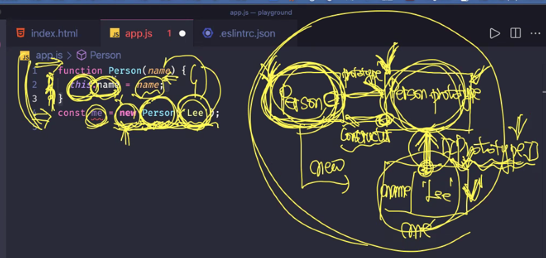
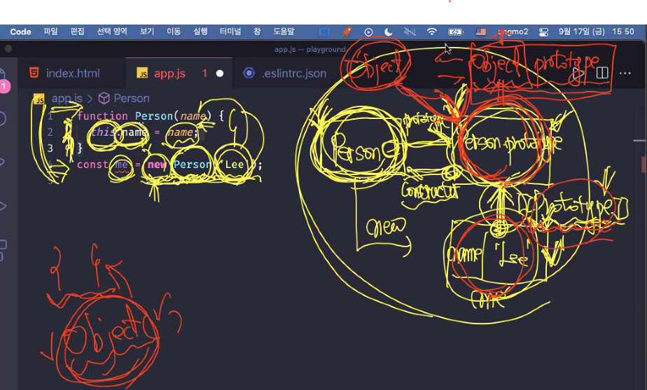
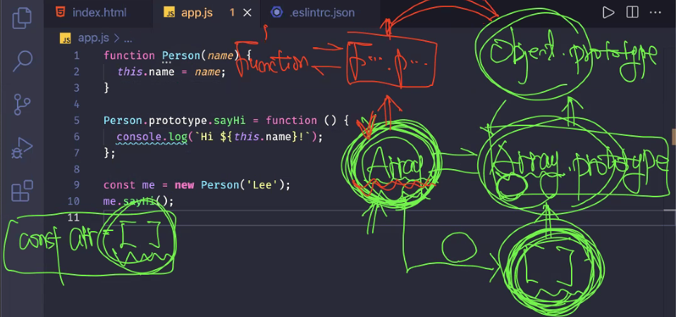

<!--  -->

## 첫 번째 시간

- 똑같은 일에 똑같은 실수를 하지 않는 것이 중요. 문제를 해결하는 과정에서 근본적인 원인을 파악하는 것이 결과만 만들어내는 것보다 더 중요하다. 빨리가는 유일한 방법은 제대로 가는 것이다.

- `const copyPerson = { ...person, address: { ...person.address } };` 가독성과 편의성을 추구하는 상황이라면 이러한 간단한 코드가 더 효율적

- 재사용을 할 수 없다는 것은 평가되어 실행될 당시에 메모리에는 있지만 스코프에는 없다는 것. 즉, 식별자와 바인딩이 되어 있어야 스코프에 들어갈 수 있다는 것.
- 함수 정의가 평가(값을 만드는 과정)되면 함수 객체(결과값)가 생성된다. 함수 호출은 이 다음 단계. 호출되어야 이 함수(식별자)의 스코프가 만들어진다. 매개변수도 식별자이므로 이 스코프 안에 있다고 볼 수 있다.
- 함수 호이스팅은 객체(틀)만 메모리에 만들어진 것. 함수 내부 코드는 텍스트로만 존재하는 것.

## 두 번째 시간

**19장 프로토타입**

- 생성자 함수의 메서드를 프로토타입으로 이전해서 인스턴스가 상속받아 사용하게 한다는 것은 좋다. 그렇다면 재사용성을 좀 더 효율적으로 구성하는 방식은 그냥 메서드를 별도의 함수로 구성해서 필요할 때 사용하는 게 낫지 않을까?
- 코드를 짤 때 문제해결을 위핞 나의 철학이 들어가 있어야 한다. 그렇게 한 이유가 명확해야 함. 카피앤 페이스트는 문제는 해결해 줄지 몰라도 내가 가진 문제 상황에 맞는 철학은 아닐 수가 있다.
- 프로토타입이 가지고 있어야만 그걸 가지고 인스턴스가 어떤 일을 할 수 있다. 상속은 이러한 의존성을 만든다. Tight Coupling 이라고 한다. 서로간의 의존성이 심한 것을 말함. 좋지 않은 현상. 따라서 상속이 무조건 좋은 것은 아니다.
- 상속받아서 사용한 메서드, 프로퍼티가 어디로부터 상속되었는지 명확하게 알 수 없다는 단점도 있다.
- `Object.prototype.hasOwnProperty('프로퍼티');` 메서드는 `Object.prototype` 프로토타입 체인에 있는 객체들은 `Object.prototype`의 메서드를 상속받아서 메서드 사용시 `Object.prototype` 부분을 확인하고자 하는 객체로 바꿔서 해당 메서드를 사용할 수 있다. 그런데 이렇게 하면 어떤 객체를 생성했을 때, `Object.prototype`에 프로토타입 체인에 있지 않은 객체가 이 메서드를 사용하면 TypeError가 발생한다.
- 반면에 `Object.hasOwn(인스턴스, '프로퍼티')` 메서드는 에러를 발생시키지 않는다. 따라서 이러한 (정적)메서드 사용을 권장하지만 아직 표준은 아니다. 그래서 Node 환경에서는 안된다. 함수형과 객체형 프로그래밍이 묘하게 섞인 형태. 비슷한 함수(기능)를 하나의 덩어리로 모으기 위해 Object라는 객체를 사용. 좀 더 나은 방식이라고 한다면 모듈을 활용해 그 모듈 파일에는 함수형으로 모아두고 export 해서 필요한 파일에서 import해서 사용하는 것.

## 세 번째 시간

- 메서드가 없는데 생성자 함수를 사용할 필요가 있을까? 내부에 프로퍼티만 존재해서 재사용할 거라면 일반 함수로 정의해서 사용하는게 낫다. 메서드가 있다면 생성자함수에는 프로퍼티만 넣고, 같이 생성된 프로토타입에 메서드를 올려서 상속받아 인스턴스가 사용하게 만드는 것이 효율적이지 않을까? 그리고 상속받지 않는, 다시 말해 프로토타입 체인에 없는 객체에서도 필요한 메서드라면 프로토타입 메서드보다는 정적 메서드로서 사용하게 하는 것이 좋을 것.

- `Person` 이라는 생성자 함수가 정의되었을 때 해당 코드가 평가되어 함수 객체가 생성되면, 내부에는 `[[Call]]`, `[[Construct]]` 내부메서드와 `[[Environment]]` 내부슬롯 등이 만들어 진다. `[[Environment]]` 자신의 상위스코프(전역스코프)?를 가지고 있는데 이 말인즉슨 렉시컬 스코프에 의해, 다시 말해 호출이 아닌 정의된 시점에 의해 상위스코프가 결정된다는 증거다.
- 동시에 `Person.prototype` 이라는 프로토타입 객체도 쌍으로 생성된다.
  
- `Person.prototype`도 객체인데 얘는 누가 생성하는걸까? Object라는 생성자 함수가 실제로 생성하는 것은 아니지만 가상의 생성자 함수로 Object라는 생성자 함수에 의해 생성된다고 생각하자는 것.

## 네 번째 시간

- 배열을 생성했을 때 생성자함수와 프로토타입은 어떻게 생겼을까? 배열객체가 Array 생성자 함수를 가상의 생성자 함수로 갖는다. 그래서 new 로 생성되었다는 연결관계를 그림에서 사용하지 않았다.

**`__proto__`**

- `__something__` 에서 `__`를 쓴다는 것은 코드로 직접적인 사용을 하지말라는 컨벤션이다.

**프로토타입 교체**

- 프로토타입 교체부분에서 왜 Person에 생성자함수와 메서드 별도 저장 코드를 즉시실행함수로 감싸서 할당했나?

- 생성자함수와 메서드 별도 저장 코드 사이에 다른 코드가 삽입되지 못하게 한 덩어리로 묶기위함이고, 동시에 즉시실행함수로 한 번만 호출 및 생성해서 할당하게 하기 위함. 즉시실행함수가 아닌 그냥 함수로 감싸면 별로도 필요할 때마다 호출해야하고 그 때마다 새로 생김?

**`instanceof 연산자**

- 생성자함수에 바인딩된 프로토타입의 프로토타입 체인에 존재하는가를 판별하는것.

**정적 프로퍼티/메서드**

- 프로퍼티 메서드는 인스턴스로 호출. 정적 메서드는 생성자함수로 호출. 인스턴스에서 직접 메서드를 사용하는 것은 권장되지 않음. 그러면 우선순위는 정적메서드, 그 다음이 프로퍼티 메서드.

## 다섯 번째 시간

- `Object.prototype.hasOwnProperty.call(person, key)` 에서 `Obejct.prototype.hasOwnProperty` 는 함수객체이므로 `call`은 `Function.prototype`에 있는 메서드일것.
- call은 this를 앞에 오는 함수객체의 `Object.prototype`에서 첫번째 인수 person으로 갈아끼운다.
- 두 번째 인수는 `hasOwnProperty` 메서드의 인수

- in은 순서를 고려하지 않기 때문에 순서가 중요하지 않는 객체에만 써야한다. 배열은 순서가 중요하기 때문에 in 문을 쓰면 안된다.

- 22장 ~ 32장까지 예습 범위
- 27부터는 직접 쳐보면서 알아가는 영역. 있는지 없는지 알아야 찾아서 사용할 수 있다. 암기는 필수가 아니다.
- 배열파트는 힘줘서 공부.
- 정규표현식은 이해가 안되면 넘기기.
- 클래스의 super 키워드 이후부터는 어려울 수 있으니 가볍게 읽고 넘겨도 됨.
-
