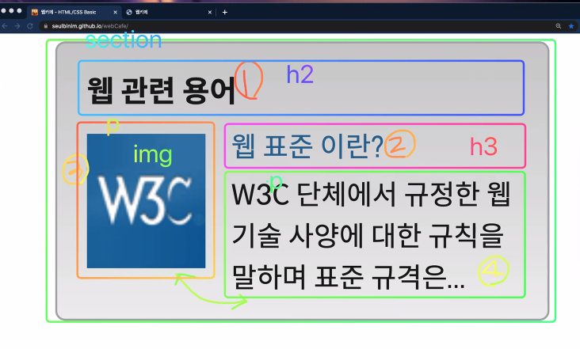

## 첫 번째 시간
- 요약 정리할 때, 나의 문장으로 정리해야 함. 공식문서의 문장을 그대로 가져오는 것은 지양

- 클론코딩을 할 때, 똑같이만 만드는 것보다 내가 보기에 더 좋게 만들려면 어떻게 할 수 있을까를 고민해보고 개선해보면 더 좋을듯
<좋은 예시들>
https://github.com/dreamfulbud/TIL
https://github.com/LimEunSeop
https://shhn0509.gitbook.io/react/ (리액트 프로젝트 로그)

### 과제 관련
- 마크업의 공통된 부분을 어떻게 만들어나가고 재활용할 수 있을지를 고민해 볼 필요가 있다. 과제도 그런 측면의 고민이 녹아나야 함. form은 크로스 브라우징 측면에서 스타일링이 까다로움. IE 7 8 9 10 들이 다 따로 놀음. 그럼 이걸 맞추기 위해 어떻게 해야할 지 찾아보고 적용해야 함.

### 메인 로그인 영역
- 마크업 하는 원칙에 대해
마크업의 순서를 결정한다. 디자인 베이스면 위에서 아래로. 왼쪽에서 오른쪽으로.
그러나 논리적으로 해보자. 컨텐츠 베이스로.

- 로그인 -> 아이디 -> 이메일 인풋 -> 비밀번호 -> 비밀번호 인풋 -> 로그인 버튼 -> 회원가입 -> 아이디/비번 찾기

- 그리드는 테이블이 발전된 형태. 그러면 테이블 측면에서 위 마크업을 고려해보자.

- 한 가지 고려해야 할 사항은 그리드와 같은 테이블 형태의 마크업 구성은 행의 윗열의 왼쪽부터 순서대로 접근한다. 필요한 셀에 병합이 이루어질 수 있는데, 이때 논리적 흐름과 병합된 테이블의 순서가 다를 수 있다. 테이블로 눈에 보이는대로만 마크업 구성을 하면 이런 문제가 발생할 수 있다. 따라서 논리적인 순서를 고려해야 한다. 리액트 컴포넌트 구성시 너무 논리에 따라 구성하면 힘들 수 있으니, 적절한 균형을 이루어야 함. 

- 네이버 로그인 페이지 예시: '로그인 상태 유지'가 '로그인 버튼' 보다 논리상 먼저 오는 것이 좋지 않을까? 이런 부분을 고민하면서 마크업을 진행해야 함.

- 제목으로의 가치가 있는 디자인 요소가 없다면, 어제 배운 숨김 컨텐츠를 활용해 제목으로 주면 된다. 
- 클래스로 네이밍시 적절하게 논리적인 의미를 고려해서 네이밍. 이런 네이밍도 분석해보는 것이 도움된다. 
- 문제해결에 대해 고민하고 개발을 진행하는 것과 그렇지 않은 것의 차이는 크다. 고민하지 않으면 자칫 코드가 산으로 갈 수 있음.

- `div`가 아무성격이 없는 것을 그루핑할 수 있는 요소라면 `fieldset`은 `form` 형식에서 필수입력서식, 선택입력서식을 각각 그루핑할 수 있는 요소다. 이 그루핑의 의미를 정확히 알려줄 수 있는 `legend`를 사용. **XHTML 1.0**은 이러한 `form` 요소 구성이 필수다. **HTML 4.01**은 필수가 아니다. **HTML5**는 두 개다 가능. 현업에서는 fieldset 버그나 legend 스타일링의 까다로움 때문에 잘 사용하지 않는 경우도 있다.

- 페이지 설계시 어떤 것이 반복적으로 재사용될 가능성이 높을까를 고민해보며 진행하는 것이 도움된다. 이를 위해 그 그릇으로 div를 사용을 고려해 볼 수 있다. 그 안에는 label과 input이 하나의 그룹으로. 하나의 input은 하나의 label과 연결되어 있어야 한다. label이 없다면 숨김컨텐츠로 보이지 않게 하면 된다. label을 쓸수 없는 상황이라면 aria-label로 접근성 측면을 고려해야 함. 

- 회원가입, 아이디/비번 찾기는 링크성격이므로 굳이 form 안에 넣지 않아도 된다. ul 요소 안에 li 2개 그 안에 a 링크로 구성 할것. div 안에 바로 a 링크를 넣게 되면 li와 달리 몇개의 링크가 있는지 보조기기가 인식할 수 없다. ul, li 안에 a 링크를 넣게 되면 링크 갯수를 파악할 수 있다.


### 실습
- id naming은 class와의 구분을 위해 카멜케이스로 표기.
- labeling 방법은 암묵적, 명시적으로 나뉜다. 
nested 형태로 암묵적 레이블링. for, id 속성이 필요없다. 그러나 위치를 지정하는 것이 어려워질 수 있다. 따라서 명시적으로 하는 것이 보다 관습적인 방법이다.

```html
<!-- nested labeling -->
<label>
    아이디 <input type="text">
</label>
```
- label 안에 이미지 사용도 가능
```html
<label></label>
```
- 만약 span과 같이 써서 장식용의 이미지 용도라면 alt를 주면 안된다. 없다면 alt를 꼭 사용.
```html
<label><span>아이디</span></label>
```
- 줄바꿈하면 원하지 않는, 예상치 못한 공백이 삽입될 수 있다.
```html
<label for=""></label>
<input type="text">
```

<hr>

## 두 번째 시간
- XHTML 은 required 속성을 `required="required"` 와 같이 명시적으로 해야 함.

- vscode XHTML 자동완성으로 바꾸는 것을 추천. 빈 태그 </>로 표시해줌. `setting.json` 에 추가.
```json
"emmet.syntaxProfiles": {
        "html": "xhtml"
     },
```

- `placeholder`는 `label`이 아니다! 입력값에 대한 힌트 용도. 사용자를 헷갈리지 않게 UI를 완성해야 함. 디자인적으로 심플하게 만들려고 할 때 무언가를 빼려고만 할 수 있는데 그렇게 할 경우 사용자 경험을 떨어뜨릴 수 있다. UI/UX를 동시에 고려해야 하는 이유.

- form의 action 속성을 통해 보낼 가상의 서버처럼 사용할 수 있는 링크 생성 서비스
https://formspree.io/

- 버튼이 form 태그 바깥에 있다면? 버튼 클릭해도 아무 액션이 일어나지 않음. 서버에 전송할 수 없기 때문. form 태그에 id 속성을 주고, 버튼에 form 속성을 사용해서 연결해주면 바깥에 있어도 전송가능.

- name 속성은 서버 DB에 필드와 같다. id 와 값을 통일해도 되고 안해도 되고.

### 메인 로그인 영역 스타일링
- .login 부분 <br>
border-radius, gradient
내부 여백은 어떻게 줄 것인가? padding
- h2 <br>
color, f-s, f-w
- form의 위쪽만 모서리 둥글게, 회원가입 아래만 모서리 둥글게, 서로 연결되어 있는 형태이므로 둘 사이에 마진 없이.
- 로그인 버튼은 어떻게 오른쪽으로 옮겨줄 것인가? flex를 쓰면 자꾸 래핑해야 할 수도 있다.
- UI를 직접 구성할 수 있는 사람이라면 다른 사람의 코드를 보며 옥석을 가려낼 수 있다. 협업시 적극적인 의견 개진이 가능해진다.

<hr>

## 세 번째 시간
### 스타일링 이어서
- font-size 에 agent style이 적용되어 있을 수도 있으니 원하는 스타일이 있다면 inheritance 외에 따로 값을 부여해주는 게 좋다.
- css 변수를 사용하는 `var()`는 구형브라우저에서 지원하지 않음.
- 블록속성을 갖게하면서 가로로 흐르는 흐름은 유지하고 싶다면 `inline-block` 을 고려해본다.
- css tag 선택자를 사용하는 것은 안티패턴에 속함.
- input은 고정 크기를 사용하기도 함. 필요하다면 내부 글자크기에 맞춰서 적용하기도 함.

- input 요소에 일괄적으로 마진 탑으로 간격을 벌려줌.
```css
.user-email ~ div {
    margin-top: 5px;
}
```
- 현재 요소의 글자 색을 가져다가 쓸 수 있음. `currentColor` 속성.

```css
border: 1px solid currentColor;
```

- offset parent = cotaining block. float 시 기준이 되는 박스. float 사용시 이것을 무엇으로 할 것인가? 를 고민해봐야 함. 

<hr>

## 네 번째 시간
- 암묵적인 아웃라인은 섹션으로 묶지 않는다. 따라서 만약 h2를 사용한다면 다음 h2를 만날때까지 하나의 암묵적 아웃라인을 형성한다고 생각하고 작업을 진행하면 된다.

### DTD
- Document Type Definition 의 약자로 조선말로 문서 형식 정의라고 할 수 있다. 브라우저에게 이 문서가 어떤 형식을 따르고 있다는 것을 알려준다. DTD 선언 방식에 따라 브라우저 렌더링 방식이 바뀐다. 선언하지 않을 경우 비표준모드로 렌더링되어 크로스 브라우징 이슈가 발생할 수 있다.
- HTML5 이전의 문서형식은 참조 URL이 들어간다.
- 문서 형식의 종류는 다음과 같다.
    1. Strict

    2. Transitional
    
    3. Frameset
- **Strict** 는 엄격한 규격으로 CSS 사용을 장려하기 위해 font 태그와 같은 요소들을 배제한 문서형식이다.
- **Transitional** 는 과도기적 규격으로 표준이 정립되지 않은 때의 문서들과 호환을 위해 사용된다.
- **Frameset** 는 현재 사용되지 않는 프레임셋을 구현하는데 사용된다.

### A 태그 `target="_blank"` 관련 이슈
#### noopener
- `<a>`태그를 통해 연결된 링크를 `target="_blank"` 속성으로 새 페이지에서 보여줄 경우, JS로 window.opener 객체에 접근해 연결된 링크를 바꿔치기 하는 보안 이슈 발생 가능성이 있다.
- 여기에 더해 현재 페이지와 링크된 페이지는 같은 프로세스를 통해 실행되는데, 링크된 페이지가 높은 부하를 유발하는 JS를 사용하고 있다면 링크를 건 페이지에도 영향을 미쳐 퍼포먼스 저하가 일어날 수 있다. 
- 따라서 `rel="noopener"` 속성을 부여해 관련 이슈 발생을 방지할 수 있다.
#### noreferrer
- referer 란 현재 페이지를 요청한 이전 페이지가 무엇인지 알 수 있는 흔적을 말한다. A 에서 B 사이트 방문시, B 사이트로 
A 사이트의 참조 주소(referer)를 전송하게 된다. 따라서 B 사이트의 관리자는 이 referer를 보고 자신의 페이지 방문객이 A사이트를 통해 방문했다는 사실을 알 수 있다. 
- referer 또한 조작이 가능하기 때문에 해당 정보를 사용할 때는 보안 이슈를 고려해야 한다.
- 따라서 `rel="noreferrer"` 속성을 부여해 관련 이슈 발생을 방지할 수 있다.
#### nofollow
- 검색엔진이 연결된 링크페이지를 크롤링하지 않을 수 있도록 한다. 검색의 대상이 아니라고 생각되는 로그인 페이지 등을 연결시 사용을 고려해 볼 수 있다. 그러나 이를 무시하고 크롤링 할 수도 있다.
```html
<a href="[연결할 페이지의 URL]" target="_blank" rel="noopener noreferrer nofollow">
```
- margin collapses 는 flex 박스일때는 발생하지 않고 normal flow일 때만 발생한다.

- 고정 높이를 쓴다면 내부 텍스트를 정렬하기 위해 line-height 도 같은 높이를 줘야함. 그러나 font-size가 커진다면 자연스럽게 줄바꿈이 되지않고 overflow가 일어남. 무언가를 고정하면 유연해지지 않는다.

- `<a>` 태그를 블록요소화시키고 padding을 주면 패딩만큼의 영역을 차지한 링크 버튼과 같이 만들 수 있음.

- nhn 코딩 컨벤션 (오래됐지만 참고할만한 자료)
https://nuli.navercorp.com/data/convention/NHN_Coding_Conventions_for_Markup_Languages.pdf

<hr>

## 다섯 번째 시간
### 웹 관련 용어
- 제목 레벨을 6번까지 가는 것은 정보 단계를 너무 깊이 구분한 것.


- img를 넣더라도 의미있는 태그 내부에 넣어주는 것이 좋을 수 있다. 해당 실습에서는 p 태그 안에 img 삽입.


- dt 와 dd는 1 : 1, 1 : many, many : 1 대응이 가능하다. 문법적으로는 허용하지만 웹 접근성 측면에서는 하나의 dd에 몇개의 dt가 대응되는지 알 수 없으므로, 1 : 1 대응을 하는 것이 좋다.

- dl 내부에 자식요소로 div를 쓸 수 없었지만 리빙 스탠다드에 허용하게 되었다. 다만 주의사항이 있는데, div 안에 dt 와 dd가 세트로 자식요소로 들어가 있어야 한다. div 바깥에 dd만 나와있다면 syntax error다.

- 위와 관련해서 HTML 5.2 변경점에 대한 이해를 도울 아래 링크 포스트 참조.
https://mulder21c.github.io/2017/12/26/understanding-html-52-changes/

- 링크 하나에 여러가지 요소, 이미지, 제목, 기사 등을 많이 넣게 되면 보조기기 사용자에게는 접근성이 좋지 않다. 내용 파익이 어려움.

- 정말 장식용 이미지가 아니라면 대체텍스트를 주는 게 SEO 측면에서 효율적이다. 검색 최적화 관점에서, 로고가 검색해서 나온 결과일 가능성이 높은 이미지라면 '로고' 라는 용어를 alt에 넣어도 된다.