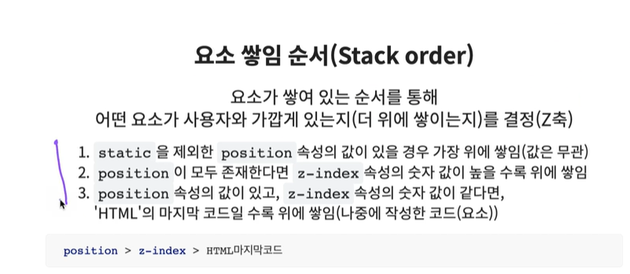

### float
**float의 display 수정**
- 대부분의 요소들이 `float`이 부여되면 블록요소가 된다. 따라서 강제적으로 `display: block` 부여할 필요가 없다. 단, `flex`와 `inlien-flex`가 부여된 요소에는 `float`를 적용해도 block 으로 바뀌지 않는다.

- 가상요소 선택자는 기본적으로 inline 속성을 가지고 있다.

- `float`을 해제하기 위해서는 `float`이 있는 형제요소들에 `float`이 적용되지 않은 요소가 있으면 안된다. 

### position
- `absolute`가 적용된 요소는 부유하게 된다. 위치의 기준이 되는 요소는 static 이 아닌 position 속성값이 부여된 요소(컨테이너)다.
- `relative`가 적용된 요소는 위치의 기준이 자기 자신이다. 따라서 `abosolute`의 부모가 되는 요소에 `relative`를 많이 사용한다. 원래 자기 자신의 위치에서 특정 위치로 이동하기 위해 사용한다. 
- `fixed`가 적용된 요소는 위치의 기준이 뷰포트(브라우저)다.
- `sticky`가 적용된 요소는 스크롤이 되는 영역(컨테이너)을 위치의 기준으로 한다.

- `z-index`는 `position`이 부여된 요소에서만 효력이 있다. 기본값은 0이고 높은 값이 부여될 수록 위로 올라오게 된다. 

**position의 display 수정**
- static, relative, sticky를 제외하고 absolute, fixed 속성 값이 적용된 요소는 display 속성값이 대부분 block으로 수정됨. 단, `flex`와 `inlien-flex`가 부여된 요소에는 position 속성 값을 ㅂ여해도 block 으로 바뀌지 않는다.
