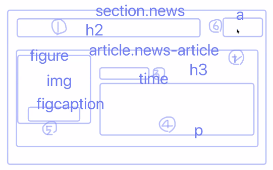
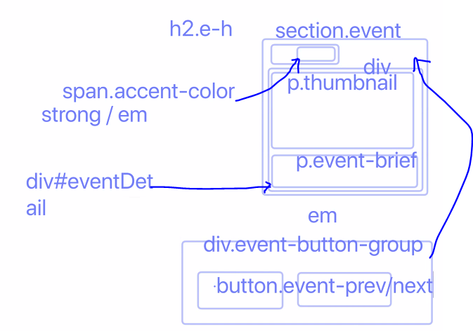

<!--  -->

## 첫 번째 시간
- label을 이미지로 넣는 것은 대표적으로 잘못된 사례.

**새소식 section**


- 접근성 측면에서는 section, article과 같은 태그는 큰 의미가 없다. header와 같은 태그가 의미가 있는 태그.

- 부모의 heading을 고려해 h1을 h3로 자동으로 바꿔주는 방식이 있었는데 이제는 지원되지 않음. 따라서 명시적으로 직접 지정해주어야 한다.

- class와 id에 같은 값을 부여해도 parcer(?)는 다른 것으로 인식함.

- img 에 대한 정보를 `aria-labelledby`를 통해 참조하고 대체텍스트를 입력하지 않았다면 검색 최적화 관점은 포기한 것으로 볼 수 있다.

- 이미지의 대체텍스트와 관련된 정보를 `figcaption`과 같은 태그에 동일하게 입력했다고 해서 접근성을 위반한 사례로 볼 수 없다.

- 과거에는 inline 요소에 블록 요소가 포함될 수 없었다. HTML5부터 가능. a 태그에 블록요소가 들어갈 수 없었는데, 변화됨. 
- a 태그가 transparent 모델이므로 가능. 따라서 article 전체를 a 태그로 감싸서 어디를 클릭하던 링크로 넘어갈 수 있다.
- 문법상 가능하고 기능상 편리하지만, 사용자 입장에서는 불편할 수 있다. 좋은 패턴은 아니다. 앵커 태그의 맥락이 끊기지 않고 덩어리로 많은 정보를 담고 있기 때문.

- h3의 기존 `font-size` 는 상속된 값보다 우선한다. css에서 부모요소의 custom `font-size`가 cascading 되지 않는다. h3 에 `inherit`를 준다면 상속을 강제할 수 있다.

- `<hr>` 의 경우는 의미적으로 구분 하기 위해 사용한다. 의미적으로 구분이 없다면 한 덩어리로 보고 border 스타일을 변경하는 등 다른 방식을 고려해야 한다.

<hr>

## 두 번째 시간
- 대한항공 ARIA 적용 사례 gitbook
    - https://aoa.gitbook.io/skymimo/

- background 의 `linear-gradient()`에서 right 등으로 방향을 주지 않을 거라면 deg를 활용해 볼 수 있다. `90deg` 와 `to right` 는 같은 효과를 나타낸다.

- 1px 보다 얇은 디자인 (스케일 조정, 투명도 조절, linear-gradient, box shadow)
    - linear-gradient 의 경우 상하 그래디언트로 아래부분은 투명도를 주면 얇게 보일 수 있다.
    - https://brunch.co.kr/@euid/6

- 일반적인 reset css 와 normalize는 어떻게 다른가?
    - https://brunch.co.kr/@euid/2

- CSS layout patterns
    - https://csslayout.io/patterns/

- flex로 새소식 section의 레이아웃을 구성할 경우, article 부분의 높이를 고정해줘서 column 방향으로 나열시 컨테이너가 요소의 크기만큼 커지지 않게 만들 수 있다. 단, 이럴 경우 높이를 고정했기 때문에 새소식의 내용을 아래에 추가하는게 까다로워진다.

- `position: absolute;` 새소식 section의 레이아웃을 구성할 경우 유연성을 고려해본다면 어떤 요소에 padding을 주고, absolute를 준 요소를 어떤 위치에 배치할지 등과 같이 좌표만 적절히 고려하면 좀 더 유연하게 배치가 가능하다. 단, 본문이 짧아질 때 부모 요소의 높이가 줄어들어 레이아웃이 무너질 수 있다. 그러므로 썸네일 높이만큼 `min-height`를 주는 것을 잊지 말자! 

<hr>

## 세 번째 시간

**신규 이벤트 영역**


- heading의 특정 부분 텍스트만 다른 디자인을 줄 경우, strong, em, span, i 등을 고려해볼 수 있다. <br>
    - strong : 의미적 강조. 굵게표시. 문장의 일부분에 중요성을 추가하기 위해 사용. <br>
    - em : 의미적으로 강조. strong과 다르게 기울임으로 표시. 구어체 강조와 같이 문장의 의미를 변경하는데 사용. <br>
    - i : 맥락의 변화 <br>
    - span : 디자인만 변경할 목적

- 이미지가 장식용이라고 생각되더라도 대체텍스트를 삽입하면 검색최적화 관점에서 도움은 될 수 있다. 그러나 이 부분도 현업에서 논란이 있는 부분이다.

- 버튼 내부는 텍스트가 아니지만, 의미가 있으며 조작 가능해야하는 버튼이다.
    - 그러므로 아리아 레이블로 의미를 지정해줘야 한다.
    - 과거에는 "이전 이벤트 보기" 등의 텍스트를 넣고 숨김콘텐츠화 했는데, 이런 경우 "어떤 것의" 이전 / 다음 이벤트인지 의미를 부여할 수 없다.

- 통상적으로 현업에서는 이미지 그 자체가 아니라, 이미지를 디브로 감싸고 거기에 그림자를 부여하는 방식을 쓴다.
    - 그래야 클래스를 뺄 때 바로 그림자를 없앴다가 넣었다가 할 수 있다!

**CSS sprite**
- css sprite 기법. `background-position` 속성을 활용해 하나의 이미지 중 원하는 부분만 사용하는 것.
- 크로스 브라우징에 용이하다.
- text indent 트릭과 padding 트릭이 있음. 오늘 사용한 것은 padding 트릭.
- 찾아서 정리 필요.

<hr>

## 네 번째 시간
- flex가 적용된 요소는 margin collapse가 일어나지 않는다.
- background 단축속성과 개별 속성의 우선순위 차이?
- overflow가 가진 단점 중 하나는 focus했을 때 아웃라인을 보이는 것을 focusring 이라고 하는데, overflow 로 hidden 처리되어 보이지 않는 영역의 아웃라인은 볼 수 없게 된다.
- 따라서 img를 삽입한다면 텍스트에 대한 overflow 처리를 고집하는 것보다 span 태그로 텍스트를 먼저 마크업하고, 같은 위치에 이미지가 텍스트를 덮도록 하는 방법도 고려해볼 수 있다.
- 결국, 버튼 요소에 텍스트 컨텐츠가 있고, 이것을 안 보이게 해야하는 경우 스타일링이 까다로워진다. 이럴때 aria-label 을 사용한 방법을 고려해 볼 수 있다.

<hr>

## 다섯 번째 시간
- text-indent 는 블록요소에만 적용가능.
- `transition`은 아래와 같이  `transition`내부에 지정된 속성에 대해 변화의 끝 부분에 대한 고정적인 값을 부여해줘야 한다. (ex. `height: 147px;`)
- auto 값을 부여할 경우 `transition` 적용이 되지 않는다.
```css
.related-list {
    padding-left: 0;
    margin: 0;
    list-style: none;
    background-color: #fff;
    border: 1px solid #aaa;
    border-radius: 5px;
    height: 28px;
    overflow: hidden;
    transition: height 400ms;
}
.related-list:hover {
    height: 147px;
    padding: 10px 0;
}
``` 