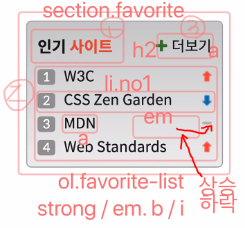
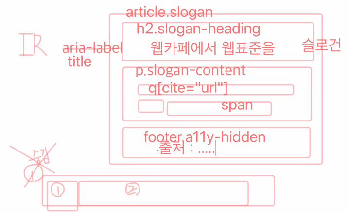

<!--  -->

## 첫 번째 시간
- 디자인적인 관점 뿐만아니라 컨텐츠적 관점으로도 고민하며 시멘틱한 마크업을 구성하기 위해 노력해야 함.

- 버튼은 form 요소이므로 크로스 브라우징을 고려한다면 `appearance: none;` 을 줘서 기본 스타일을 제거하고 작업을 진행해야 함. 해당 속성으로 없어지는 기본 스타일이 브라우저마다 다를 수 있음. 따라서 안전한 크로스 브라우징을 원한다면 `-ms-`, `-webkit-` 등의 세부적인 prefix를 붙여주는 것이 좋다. hidden contents 를 위해 여러 개의 clip 속성값 부여 방식을 쓰듯이.

<hr>

## 두 번째 시간



**CSS counter**
- MDN : https://developer.mozilla.org/ko/docs/Web/CSS/CSS_Lists_and_Counters/Using_CSS_counters

- `counter-reset` 속성으로 초기화해서 사용해야 함.
```css
/* section이라는 counter 이름을 부여함과 동시에 초기값 0을 가짐 */
counter-reset: section;
```
- 초기화 된 counter 값을 `counter-increment`에 따라 증가시키거나 감소시킴.
```css
/* section이라는 counter 값을 1씩 증가시킴 */
counter-increment: section;
```
- 증가시킨 counter 값을 `::before`와 같은 가상 요소 선택자의 `content` 속성에 사용할 수 있음.
```css
/* Section 1: , Section 2: , ... */
content: "Section " counter(section) ": ";
```
**attr() function**
- MDN : https://developer.mozilla.org/en-US/docs/Web/CSS/attr()

- `content` 이외의 속성에 대한 지원은 아직 불분명함.
- `attr()`의 인수로 속성명을 사용하고 해당 속성명이 가진 값을 반환함.
```css
/* data-foo라는 속성이 가진 값을 content로 사용 */
[data-foo]::before {
  content: attr(data-foo) " ";
}
```

**flexible box의 auto margin**
- css tricks: https://css-tricks.com/the-peculiar-magic-of-flexbox-and-auto-margins/

- padding은 negative 값을 가질 수 없지만 margin은 가능. negative margin 찾아서 정리해보기. 혹은 Wiki repo. 참조.

**실습: slogan**



- IR(Image Replacement) : css sprite가 이런 방식의 한 종류.
https://css-tricks.com/css-image-replacement/

- `q` 태그는 인라인 단위의 인용문. `blockquote` 는 블록 단위의 인용문.

- q 태그 관련 `quotes` 속성 사용법. 내부적으로는 before, after로 앞 뒤에 인용부호 적용됨.
https://developer.mozilla.org/en-US/docs/Web/CSS/quotes

- main 태그와 달리 특정 section, article 태그 안에서 필요하다면 header, footer를 여러번 활용해 볼 수도 있다.

<hr>

## 세 번째 시간
- position이 유연하지는 않지만, grid를 쓸수 없는 상황이라면 position이 대안일 수밖에 없다.

- 하나의 요소안에 높이와 줄높이를 같은 값을 주면 요소의 정중앙에 배치된다.
```css
height: 83px;
line-height: 83px;
```
<hr>

## 네 번째 시간

**실습: footer**

- address 는 푸터에만. 본문 주소는 p 태그로.

- small 태그. 덧붙이는 글, 저작권과 법률 표기 등의 작은 텍스트에 사용.
https://developer.mozilla.org/ko/docs/Web/HTML/Element/small

- &copy;로 copyright 기호 입력 가능

- `word-spacing` 처리를 통해 화면에 보이는 것은 붙여서 보여주고, 보조기기 등으로 읽는것은 띄어서 읽도록 할 수 있음.
https://developer.mozilla.org/ko/docs/Web/CSS/word-spacing

- `mailto:seulbinim@gmail.com?subject='문의사항'` 물음표부터는 메일주소 클릭시 문의사항
- `tel:01012341234` 전화 걸기로 연결되는 링크.

- flex가 부여된 컨테이너는 직계 자손에만 영향을 미침. 직계가 아닌 후손에 a 태그와 같은 요소가 있다면, flexible box 의 child elements로 동작하지 않는다. 

- 제일 안에 있는 자식이 커지면서 부모 컨테이너가 커지게 하는 방식을 고려함으로써 유연성을 확보할 수 있다.

- flexible box의 `justify-content: space-evenly` 는 IE11 지원 안함.

- `text-transform: capitalize` 속성으로 단어의 첫 글자만 대문자로 변환할 수 있음.
https://developer.mozilla.org/en-US/docs/Web/CSS/text-transform

<hr>

## 다섯 번째 시간

- 반응형 웹 관련 yamoo님 repo. 
https://github.com/yamoo9/cj-olive-networks/wiki

### 반응형 웹 디자인
- RWD(Responsive Web Design)시 고려해야 할 4가지
    - 유연한 그리드
    - 유연한 미디어
    - 미디어 쿼리
    - 뷰포트 메타 요소

    **유연한 미디어**
    - 이미지 최적화, 디바이스에 맞는 적절한 이미지를 제공해야 한다. 반응형이니까, 유연하니까 최적화되어 있구나 하고 생각하면 안됨. 단순히 큰 이미지를 작게 변하게 만드는 것이 끝이 아니다. 프로젝트를 할 때도 이미지 최적화에 대한 고려가 필요할 것.

    **뷰포트 메타 요소**
    - 선언을 해야만 원하는 형태로 디바이스에 맞게 디스플레이 됨. 중요하지만 의외로 놓치기 쉬운 요소.

### 반응형 웹 디자인 적용에 대한 고찰
- desktop first가 아닌 mobile first로 개발해야 함.

    **웹사이트 속도 향상**
    - lcp등 과 같은 corw web vitals 지표 측정항목을 고려해야 함. 프로젝트시 반응형 페이지에 대한 성능도 고려해야 함. 구글 검색 순위에 페이지의 웹 지표 점수를 반영되어 노출해 줌. 사용자 경험 개선 뿐만 아니라 검색엔진 최적화와 연결됨.
    - LCP 최적화 : https://ui.toast.com/weekly-pick/ko_202012101720

    **SEO**
    - 구글 SEO 기본 가이드 : https://developers.google.com/search/docs/beginner/seo-starter-guide?hl=ko


### 반응형 웹 디자인을 시작하는 방법
- 발표할 때 반응성 테스트 결과를 말하는 것도 플러스 요인.
구글 모바일 친화성 테스트 : https://search.google.com/test/mobile-friendly

- Troy 는 서비스 종료됨.

### 반응형 웹 디자인 구현 방법
- 이미지 크기를 줄여 최적화 하는 사이트를 활용해보자.

- 모바일을 우선해서 마크업을 시작해보자.

- 작은 모바일 화면에서도 쉽게 클릭하도록 적절한 패딩을 활용하자.

- Tailwind CSS 프레임워크 추천. atomic desgin. 모바일 친화적.

### 적응형 웹 디자인 VS 반응형 웹 디자인
- 적응형 웹(Adaptive Web Design)
- 둘의 차이는? 면접 빈출.
- 적응형 웹은 마크업 자체가 이원화 되어있을 수 있다. (ex. m.daum, m.naver)
- 모바일 환경에 대응하기 위한 별도의 서비스.
- 어떻게 보면 콘텐츠 최적화 관점에서, 즉, 성능과 관련해서 반응형 웹은 좋은 선택이 아닐 수 있다.

- 야무님 깃허브 출처에서 추가적인 내용도 확인하면서 나만의 반응형, 적응형 웹 관련 내용을 정리하는 것 추천.

- 내일부터 이디야 음료 탭 페이지만 반응형으로 만들 예정. 기본 CSS 로 해보고 Sass 로 바꿔서 할 예정. 픽처 요소, srcset, 레티나~~ 관련 개념에 대한 이해가 필요할 것. 클래스룸 압축파일에 있는 자료로 해당 개념을 배워갈 예정.

