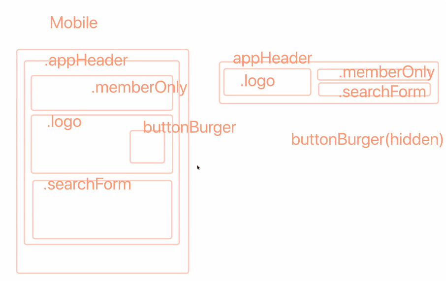
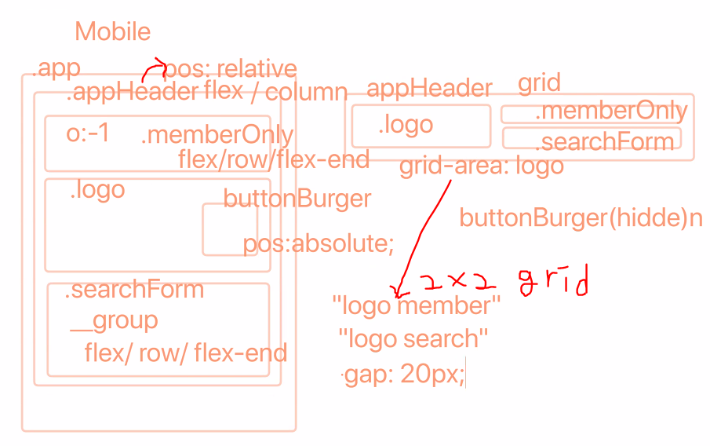

<!--  -->

## 첫 번째 시간
- postcss normalize 는 dart sass 도 지원함. `normalize.css` 검색하면 대부분 node sass 일 것.

**package.json**
- postcss 는 직렬 실행이 중요한 경우가 있음. css가 나와야 postcss가 수행가능하므로, 직렬, 병렬 옵션 지정이 필요함.`npm-run-(p 또는 s)`에서 `p` 옵션이 병렬, `s` 가 직렬.
- `run-p dev watch:**` : `p` 병렬로, `dev` `live-server`를 실행시키고, `watch:**` 가 붙은 명령을 모두 실행시키라는 의미.

## 두 번째 시간
- 완성된 style - utils 폴더에 media-query, mixin 코드들 공부해 보면 좋을듯. 예를 들면, mixin에서 고해상도 이미지 처리에 관한 코드도 있기 때문에.

- mixin을 정의한 파일에서 mixin을 가져다가 활용하는 것도 가능. 함수와 유사하기 때문인듯? 선언 순서가 중요할 듯?

- [HTML5 `data-tooltip` 속성](https://www.sitepoint.com/how-why-use-html5-custom-data-attributes/)
- CSS `attr()`함수로 `data-tooltip` 속성 값을 가지고 와서 `::before` 선택자의 `content`로 삽입해 스타일링 하는 방식을 고려해 볼 수 있다.
- `title`속성 외에 사용자에게 추가적인 정보를 전달하기 위한 목적으로 사용됨.

## 세 번째 시간

**webcafeRWD 실습**
- **markup**

- **layout**

## 네 번째 시간
- grid는 행 높이를 주고 center 정렬할 수 있다.
- a 태그에 inline-block을 주고 상하 padding을 주면 부모의 영역과 같이 영역이 커짐. inline경우 영역의 크기는 커지지 않지만 padding이 적용되긴 함.
- 현업에서는 버튼 스타일이 크로스 브라우징 체크하면 높이에 1~2px 오차가 발생할 가능성 있어서 높이를 고정해주는 경우가 많음.
- [yamoo9 gitbook CSS grid](https://yamoo9.gitbook.io/css-grid/)

- `grid-template` 에서 `repeat()`은 IE 지원안함. IE를 위한 grid project kit 에서 다른 방식으로 가능하게 할 수도...

## 다섯 번째 시간
- `transform` 속성의 `rotate()`가 돌아가는 기준은 항상 센터다.
- 오늘의 예제에서 했던 속성이나 method들 숙련되게 연습. 