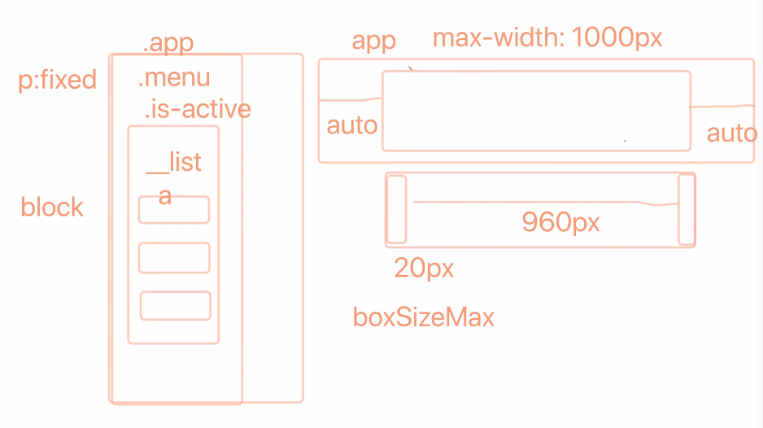

<!--  -->

## 첫 번째 시간
- 키보드 트랩

**실습 nav**



- a 태그를 자식 요소로 가지고 있는 요소는 a 태그를 블록으로 변경하고 padding 등으로 영역을 차지하게 만들어서 부모요소의 영역도 같이 커질 수 있도록.

- 요소를 연속적으로 배치하고 그 사이에 margin이 있는 경우, margin-top 하나만 주고 첫 번째 요소만 margin-top을 제거하는 방식을 고려해 볼 수 있다.

- 박스의 사이즈가 줄어들면서 가운데 정렬이 된다면 좌우는 오토 마진을 줘야한다.

- position을 이용해 navigation을 안보이게 처리하는 것보다 transform을 활용해 안 보이게 하는 것이 reflow 유발을 덜하기 때문에 성능면에서 효율적이다.

- Web Vital 관련 article (성능 측면)
    - LCP(Largest Contentful Paint)
    - FID(First Input Delay)
    - CLS(Cumulative Layout Shift)
    - 면접에서도 이미지최적화와 더불어 이러한 성능 최적화 관련 질문이 나올 가능성이 높다.
    - [관련 어센트코리아 article](https://www.ascentkorea.com/core-web-vitals/)
    - [관련 article](https://developers-kr.googleblog.com/2020/05/Introducing-Web-Vitals.html)

<hr>

## 두 번째 시간
- [`:focus-within` MDN](https://developer.mozilla.org/ko/docs/Web/CSS/:focus-within)
- input 요소가 focus 받았을 때 부모 요소의 아웃라인이 변하도록.

```scss
.formInput {
    flex-grow: 1;
    &:focus-within {
        border: 10px solid red;
    }
    
    &__input {
        outline: 0;
    }
}
```

- [`:focus-visible` MDN](https://developer.mozilla.org/en-US/docs/Web/CSS/:focus-visible)
- 버튼 클릭으로 focus 받았을 때는 아웃라인(focusring)이 보이지 않게하고, 키보드 탭으로 focus 받았을 때만 아웃라인(focusring) 보이게 할 수 있음.

```scss
.formInput {
    flex-grow: 1;
    
    &__input:focus-visible {
        outline: 10px solid blue;
    }
}
```
- focus 관련 mixin
- outline을 스타일링하기 위해 border가 아닌 box-shadow를 씀.
- border로 하면 박스만 focusring?
- focus 받았을 때 box-shadow를 바꾸는 것은 꼭 mixin 등으로 만들어 보는 것 권장.

<hr>

## 세 번째 시간
- 전체에 padding을 주는 것보다 header에만 음수마진을 줘서 좀더 보기 좋은 UI를 만들 수 있다.

- iframe은 figure 요소 안에 바로 들어갈 수 있나?
- iframe 을 반응형으로 만들기 위해서는 iframe 자체를 `position: absolute`로 띄워야 한다. 부모(iframeContainer)의 너비와 높이를 상속받아 모두 차지하게 만든다.
- iframeContainer의 너비는 부모 요소의 100%만큼 차지하게 만들고, iframeContainer의 높이는 auto가 아닌 0으로 고정한 뒤 `padding-top`에 `%`값을 줘서 iframeContainer의 부모요소 너비를 물려받아 높이를 가지게 만든다. 
- 이때 영상의 비율의 맞게 줘야 하므로 비율의 역수 `%` 만큼을 `padding-top` 속성의 값으로 부여한다.

```scss
&__iframeContainer {
    position: relative;
    width: 100%;
    height: 0 !important;
    padding-top: 56.25%;
    
    iframe {
        position: absolute;
        top: 0;
        left: 0;
        width: 100%;
        height: 100%;
    }
}
```

<hr>

## 네 번째 시간
- 클래스 속성값을 선택자로~
```scss
[class*='__enTitle'] {
    display: block;
}
```
- custom selector
- 아직 많은 브라우저에서 지원하는 기능은 아님.
뒤에 선택자들을 `--home-selection-title`이라는 이름의 커스텀 선택자로 사용하겠다는 의미.

```scss
@custom-selector :--home-selection-title .book__title, 
                                          .news__title,
                                          .board__title,
                                          .favorite__title,
                                          .twitter__title;

:--home-selection-title {
    background-color: yellow;
    font-size: rem(20px);
    font-weight: 500;
    min-height: rem(60px);
    padding-left: rem(64px);
    position: relative;
}                                          
```
- `@custom-selector`도 [`postcss-preset-env`](https://preset-env.cssdb.org/) 에서 지원하는 기능중 하나.

- 기능별로 스테이지 값이 있는데 안정적인 기능은 스테이지 3부터다. custom selector는 스테이지 1이다. `webpack.config.js` stage 설정을 1로 고치고 실행가능.

- 프로젝트 할 때, 중요한 포인트를 강조하면서 이러저러한 기능을 도입해봤다. 실패했을 때라도 이러한 이유로 추정된다, 앞으로 이렇게 해보려고 한다를 언급하면 괜찮음.

- map data 유형을 each 반복문을 활용해 작업한 코드. $colors에서 키와 밸류값을 각각 $color 와 $color-value에 할당해서 반복문 실행

```scss
@each $color, $color-value in $colors {
    .theme#{$color} {
      color: $color-value;
    }
}
```

- svg는 현재 우리가 알고 있는 스프라이트 기법을 사용할 수 없다. 추가적인 리서치가 필요함.

- [fontawesome 의 font 사용시 접근성 준수](https://fontawesome.com/v5.15/how-to-use/on-the-web/other-topics/accessibility)

## 다섯 번째 시간
- [vertical rhythm](https://designmodo.com/vertical-rhythm/) : grid와 연관되어 반응형 웹 디자인에서 언급되는 디자인 요소

- `text-align` :블록 요소나 표의 칸 상자의 **가로 정렬**을 설정. `vertical-align`은 세로.
- `data-*` : HTML5 사용자 정의 속성.
`data-tooltip` 사용법 전날 TIL에 링크 걸어둠.

- `font-size: clamp(0.75rem, 4vw, 1.125rem);` : 최소가 12px, 선호하는 값은 4vw, 최대가 18px.
`clamp(minimum, preferred, maximum);`
출처: [Front End Develop](https://frontdev.tistory.com/entry/clamp-사용하기)
`clamp()` 함수를 이용해 글자도 반응형으로 할 수 있음. 단, 호환성 확인 필요.

- tooltip의 변화가 앞 글자와 너무 부자연스럽게 이뤄지지 않도록 자기 자신 기준으로 위에서 조금 내려와 있게 만듦?

```css
position: relative;
top: rem(4px);
```

- 과제
- figma 시안 바탕으로 UI 구현
- 데스크탑에서는 테이블이지만 모바일에서는 카드뷰
sass 사용해서 UI 구현. table_card 폴더명명
내일 오전 9시