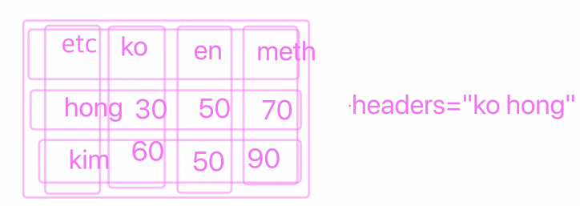

<!--  -->

## 첫 번째 시간

**실습 : 트위터, 푸터**

- `shape-outside: circle(50%);` circle 모양의 이미지에 부여해서 그 주변에 있는 텍스트가 circle 모양으로 흘러다니도록 만드는 속성. IE 지원 안함. 
- `clip-path: circle(50%);` 이미지의 주변을 가려주는 속성. 예시 코드는 주변을 가려서 이미지를 동그랗게 만듦.

- 그렇다면 사용을 하지 말아야 할까? 
- 특정한 브라우저에 최적화하는 것은 과거 IE 최적화되어 있었던 때와 다를 바 없는 것. 따라서 브라우저별로 기본적인 스타일은 제공해 최소한의 이용은 가능하게 하고, 사용자에게 특정 브라우저를 사용하면 좀 더 팬시한 UI를 보여줄 수 있다고 언급해주는 것이 크로스 브라우징의 고려할 전략 중 하나.

## 두 번째 시간

**PostCss**

- `postcss-combine-media-query` : 미디어 쿼리를 하나로 압축해주는 postcss 플러그인

- `@use './media-query' as *;` media-query에 있는 mixin 등을 현재 파일에서 가져다 쓸거라면 asterisk를 붙여줘야 한다.

- svg sprite 방식. 

- Sass project structure 또는 Sass project folders 로 검색하면 sass 폴더 클린업 방식을 찾을 수 있음.
- [Sass proejct structure 예시](https://itnext.io/structuring-your-sass-projects-c8d41fa55ed4)

## 세 번째 시간

**table card**

- [table accessibility example](https://www.w3.org/WAI/tutorials/tables/) : 테이블 접근성 예제. 테이블의 컨셉별로.

- id 는 header에만 headers는 열과 행의 header들의 모음을 입력할 수 있다.

- [반응형 테이블 관련 article](https://hyeonseok.com/blog/729)

- table을 쓰게되면 description 은 summary 태그에 넣는 것을 고려해 볼 수 있다.

- BEM 방식을 사용함으로써 명시도를 조금 낮출 수 있다.

## 네 번째 시간
- [`word-break: keep-all;`](https://developer.mozilla.org/ko/docs/Web/CSS/word-break) : word 단위로 line breaking을 주는 속성.

## 다섯 번째 시간

**TailwindCSS** 
