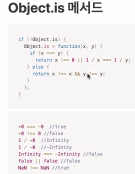

<!--  -->

## 첫 번째 시간

**Object.is 메서드**



- Object.is를 확인하는 코드는 옛날 코드다. 바벨을 쓰면 확인하는 별도의 코드가 필요없다. 바벨을 쓰지 않을 때는 쓸 수 밖에 없지만. 게다가 확인 코드 내에 실수가 있다면 디버깅도 어려워진다.
- `if(!Object.is)` 은 `Object.is`가 있는지를 확인하는 조건문.

- return 반환문은 함수 내에서 맨 마지막에 한 번만 쓰이는 것이 정석. 조건문 분기마다 들어가는 것은 좋지 않다.
- 위의 이미지의 폴리필은 삼항 조건 연산자를 고려해 볼 수 있다. 함수 표현식도 화살표 함수를 고려해 볼 수 있다.

**가비지 컬렉션**

- 면접에서 자세한 알고리즘까지는 물어보지는 않지만 개념에 대해서는 물어볼 수 있다.

- 실행 컨텍스트라고 하는것은 함수에 스코프 단위로 저장되어 있는 C++객체. 스코프 단위라는 덩어리로 들어있기 때문에 가비지 컬렉션도 덩어리로 컬렉팅한다.

- 전역 변수는 가비지 컬렉션이 늦게 된다. 브라우저탭을 닫을 때까지 살아있다.

- 객체는 가변적이기 때문에 메모리 공간도 가변적으로 확보되어야 한다. 따라서 힙이라는 자료구조를 사용.

- Reference-counting, Mark and Sweep 알고리즘이 있다.

- 클로저라고 하는 것은 가비지 컬렉션이 되지 않는 현상을 이용한 개념.

<hr>

## 두 번째 시간

- 어떤 값을 만들어내는 절차를 프로그래밍하는 것이 절차지향형 프로그래밍
- 함수의 이름짓기가 애매하다면 함수의 기능을 쪼개야 할 타이밍
- 아래 함수를 짜면서 고려해야 할 사항들을 시뮬레이션 해보자

```js
function sumEvenNumbers (numbers) {

}

// 매개변수로 numbers 가 오기때문에 이름에서 제거할 수도 있다.
function sumEven (numbers) {
    // 아래는 명령형 코드다.
    // 이렇게 명령형으로 코드를 작성하면 의도치 않게 변수를 많이 쓰게 될 가능성이 높아진다.
    // 이러한 문제를 고려해서 나온 것이 선언형 프로그래밍 패러다임이다. 리액트가 대표적.
    // 선언형이라고 하는 프로그래밍 패러다임 안에 함수형 프로그래밍이 들어가 있다.
    var sum = 0;

    // numbers.length 는 모던 자바스크립트 엔진에서는 최적화 되어 있어서 한 번만 참조한다. 따라서 따로 변수로 생성할 필요가 없다.


    for (var i = 0; i < numbers.length i++) {
        // 받아오는 배열의 길이가 길다면 변수 선언은 안하는 게 좋을지도... 그런데 긴 배열을 가지고 반복 연산을 하는것 자체가 문제. 가독성 측면에서는 아래와 같이 선언해주는 것이 나을수도.
        var number = numbers[i];

        if (numbers[i] % 2 === 0) {
            sum += numbers[i];
        }
    }

    return sum;
}

// 여기부터는 선언형 또는 함수형 프로그래밍 코드다
function sumEven(numbers) {
    // 배열안에 여러개의 값이 존재하는데 그것을 하나로 만드는 것이 reduce의 개념. (map, filter 도 함수형 언어의 대표적인 메서드)
    return numbers.reduce(function (acc, cur) {
                return cur % 2 === 0 ? acc + cur : acc;
            }, 0)
}

// arrow function을 이용해 더 가독성이 좋게 짠 코드
const sumEven = numbers => numbers.reduce((acc, cur) => (cur % 2 === 0 ? acc + cur : acc), 0);

// HTML 에서의 선언형 예제
// <h1> 이라는 태그에 폰트 사이즈를 키우고 볼드체로 렌더링해라 라는 절차들이 포함된 선언
<h1> Hello </h1>

// 위와 같은 선언형을 짜기 위해서는 절차형에서 사용하는 반복문 로직이 머릿속에 있어야 한다. 이것이 없으면 배열 고차함수를 이해하는게 어렵다.

console.log(sumEven([1,2,3,4,5]));
```

<hr>

## 세 번째 시간

- 스위치문에서 case도 하나의 스코프. 블록문이 생략되어 있을 뿐.
- fall through
- for문의 연산 순서
- var 키워드로 선언한 변수는 함수 내부에 있을 때만 지역변수다. 반복문에서는 전역으로 쓸 수 있다. let 으로 선언하면 반복문에서도 지역변수다.
- for문의 초기화 변수 선언과 함수의 매개변수는 블록 바깥에 있다. 내부적으로는 블록 안에서 한 번만 선언된다고 생각하면 이해하기 쉽다.
- for문과 while문 선택은 결국은 가독성이 기준이 된다. 반복횟수를 고려하는 것도 결국은 가독성 목적이라고 볼 수 있다.
- 예제 8-21은 레이블 문의 대표 예제이므로 알아두는 것을 권장.

**9장 타입변환**

- Falsy 주의점 : 빈 배열, 빈 객체는 Falsy가 아니다.

- 문자열 타입 변환 방법 세 가지 중 `new` 생성자 없이 `String()` 만 사용하는 것은 애초에 생성자 함수는 객체를 생성해야 하는데 그렇지 않고 단순히 문자열로 변경만 하기 때문에 원래 의도에 어긋나는, 다시말해 시멘틱에 어긋나는 좋지 않은 방식이다.

- 숫자 타입 변환 방법 4 가지 중 강사님의 선택은 단항 연산자 `+` 를 사용하는 것.

- 불리언 타입 변환 방법 두 가지 중 `!!` 사용하는 방법을 권장.

**9장 단축평가**

- 논리 연산자를 사용한 단축 평가를 Truthy 나 Falsy를 true 나 false로 반환하지 않고 타입 변환 없이 반환한다.

- 삼항 조건 연산자는 `if..else`를 대체하는 것이고 논리곱, 논리합 연산자는 `if`를 대체하는 것

- 예제 09-24 에서 `elem.value` 에 값이 없다면 `undefined`를 반환한다.

- 함수에서도 배우겠지만 함수의 인수로 넘어오는 값을 내부에서 변경해서 사용하는 것은 안티패턴이다. 따라서 ES6에서는 매개변수에 대한 기본값을 지정할 수 있게 했다. 그러나 기본값도 개발자에게 내가 지정했다고 오해하게 만들 수 있다. 차라리 에러를 발생시켜 개발 당시 의도한 정확한 값을 인수로 전달할 수 있게 수정시키는 것이 낫다.

```js
// Vanila JS
function getStringLength(str) {
  if (typeof str !== 'string') throw new Error('문자열을 입력해야 합니다!');
  return str.length;
}

getStringLength(); // 예외처리가 안되어 있다!

// TypeScript
function getStringLength(str: string) {
  return str.length;
}

getStringLength();
```

<hr>

## 네 번째 시간

**10장 객체 리터럴**

**객체는 무엇?**

- 어떤 속성을 포괄할 수 있는 개념(또는 클래스). 사람이 무언가를 인식하는 방식도 속성을 구분지어서 하나의 개념을 포괄적으로 이해한다. 이것을 프로그래밍할 때 쓰는 개념이 객체라고 볼 수 있다.
- 이러한 속성은 명사개념도 있지만 행동을 표현하는 동사개념도 있다. 명사개념은 프로퍼티, 동사개념은 메서드라고 부른다.
- 변수가 하나의 값을 저장하는 매커니즘이라면 여러개의 값을 저장하는 매커니즘이 자료구조다. 대표적으로 배열이 있다. 배열은 인덱스를 통해 값의 위치를 식별한다면, 객체는 프로퍼티의 키로 값을 식별, 참조한다. 배열과 객체를 사용하는 기준은 순서다. 배열에는 순서의 의미가 강조된다. 따라서 배열이 반복문에 딱 맞는 자료구조다. 순회를 위한 자료구조.
- 객체는 순서의 의미가 없다. 키에 의미가 있다. 배열에 비해 값이 의미하는 바를 명확하게 알 수 있다. 추가적으로 행위를 부여할 수 있다.

- C++과 자바는 클래스 기반 객체지향, 자바스크립트는 프로토타입 객체지향이다. 그러나 프로토타입은 의외로 쓸일이 없다. 객체지향적으로 자바스크립트를 짜지 않기 때문. 그럼 이런걸 왜 알아야 하나? 아는사람과 모르는 사람의 코드 품질이 차이나기 때문.
- 클래스기반 객체지향은 프로그래밍 하기 전에 큰 그림을 그리는 설계과정이 필요하다. 서로간의 상속과 의존성을 파악하고 필요한 클래스를 미리 정의해야 하기 때문. 그러나 일에 대한 요구사항은 계속 변한다. 그럴때마다 클래스기반 객체지향은 코드를 뜯어 고쳐야 한다. 이럴 때 변한 요구사항들이 리얼타임으로 반영되기 어렵다. 비즈니스적으로 그렇게 좋지 않아 보인다. 그래서 함수형이 좀 더 유연하게 사용할 수 있는 장점이 있다.

<hr>

## 다섯 번째 시간

- 프로퍼티 키는 문자열 또는 심벌값이다. 내부적으로는 따옴표가 붙여있다고 보면 된다.
  식별자 명명규칙을 따른다면 따옴표를 안 붙여도 된다. 명명규칙에 위배되면 따옴표를 붙여야 한다. 식별자 명명 규칙을 따르는 것이 마침표를 통한 접근이 가능하기 때문에 좀 더 편리하다. 아니라면 대괄호를 사용해야 한다.
- 프로퍼티 값으로는 값으로 평가되는 것이라면 모든지 올 수 있다.
- 프로퍼티의 값으로 함수가 오면 메서드라고 부른다. 메서드는 대부분 같은 객체 내에 프로퍼티를 참조하고 조작하는 일을 한다. 따라서 객체의 메서드는 대부분 비순수함수다

**프로퍼티 접근법 두 가지 `.`, `[]`**

- 프로퍼티는 식별자와 달리 실행 컨텍스트가 아니라 프로토타입~~에 저장된다.
- 프로퍼티 키는 문자열 또는 심벌값이기 때문에 `person['name']` 으로 써야 엔진이 대괄호 접근 연산자의 피연산자를 식별자로 인식하지 않는다.

```js
// 예제 10-06 동적 프로퍼티 접근
var foo = 'firstname';
person[foo];
```

```js
// 예제 10-08 유사배열객체를 위한 예외
var foo = {
  0: 1,
  1: 2,
  2: 3,
};
```

**키워드와 예약어의 차이**

- 예약어는 엔진이 쓸거기 때문에
- 키워드는 명령어다.

**예습범위**

- 13 ~ 15장 : 내용도 쉽고 양도 적을 것. 남은 시간은 복습. 여기까지가 코어 내용으로 난이도가 그렇게 어렵지 않음. 16부터 어려워짐 19를 이해하기 위해 16~18 내용이 필요한것.
