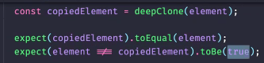
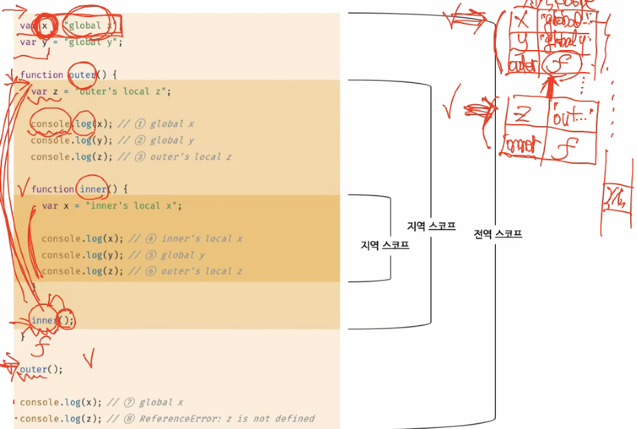

<!--  -->

## 첫 번째 시간

**JS에서 범위를 넘어갔을 때**

- 자바스크립트의 배열은 객체다. 없는 프로퍼티를 객체를 참조하면 undefined을 반환한다. 따라서 for문에서 지정한 반복횟수를 넘어가면 없는 프로퍼티 키를 조회한 것과 마찬가지이므로 undefined가 반환된다.
- map, filter 와 같은 배열 메서드는 for문 처럼 반복문이 돌아야 하는 횟수를 따로 지정하지 않고, 처음부터 끝까지 돈다. 알고리즘은 끝까지 돌지 않는 문제가 많지만 현실의 문제는 끝까지 도는 경우가 많다. 필요없는게 있다면 순회하기 전에 필터를 하는 과정을 거치기 때문에 문제되지 않는다. 다만 속도의 문제가 있을 수 있다.
- 알고리즘에서는 for문을 쓰는 것이 낫다. 그러나 과제는 안쓰는 방법으로 하는 것을 권장한다. 속도차이가 나지 않는다면 가독성을 고려해 반복문을 안 쓰는게 낫다.

**얕은 복사와 깊은 복사**

- 함수에 `...`와 함께 인수를 할당하는 경우 이러한 표기법을 가지는 함수를 가변인자함수라고 한다.
- `Object.assign()` 의 의한 얕은복사(1depth 깊은 복사)는 함수의 사용법에 대한 어려움으로 권장되지 않고, 그래서 나온거는 `...` 연산자를 사용한 얕은복사다. 그러나 둘 다 IE에서 지원되지 않을 것.
- 함수는 깊은 복사할 필요가 없다.

<hr>

## 두 번째 시간

**과제 테스트 by jest**

- 과제와 관련해서, 내가 만든 함수를 테스트하는 툴 소개. Jest?
- 모듈에 대한 간략 소개
- 자바스크립트 파일은 별도의 진입점이 없다. 따라서 파일이 분리되어 있더라도 하나의 파일에 있는 것과 같다. 즉, 하나의 전역을 공유한다. var를 사용했을 경우 중복을 허용하기 때문에 식별자 이름이 같을 경우 의도치않게 재할당이 일어날 수 있다. 그래서 ES6에서 모듈이라는 개념이 도입되었다. 파일을 구분하면 그 파일이 별도의 스코프를 갖게 된다. 그런데 이렇게 되면 a.js에 있는 변수를 b.js에서 참조할 수 없게 된다. 이럴 때 a.js에 있는 변수를 다른 파일에서도 참조할 수 있게하려면 export를 써야한다. 그러면 이렇게 export된 것을 쓰겠다는 의미는 import를 사용하는 것. Node.js는 import대신에 require를 사용한다.
- jest는 이렇게 모듈의 개념을 사용해서 별도의 파일에서 내가 정의한 함수를 테스트한다. 분리한 이유는 배포해야 할 파일과 테스트 함수를 구분하기 위함이다.

- test 코드의 의미

```js
// 맨 앞에 문자열은 어떤 테스트다 라는 의미의 문자열
// 뒤에가 실제로 테스트하는 함수
test('add(1, 2) is 3', () => {
  expect(add(1, 2)).toBe(3);
});
```



- toBe는 === 으로 같냐, toEqual 은 내용이 같냐를 비교하는 것. 따라서 deepClone으로 만든 변수가 toEqual로 내용이 같냐를 비교해야 함.
- `element !== copiedElement`이 toBe(true) 라는 것은 참조값이 다르냐 여부를 확인하는 것.

- package.json 의 script 명령어로 start, test는 `npm start`, `npm test` 만 써도 되지만 별도의 커스텀 명령의 경우 `npm run --`을 붙여줘야 한다.

**13. 스코프**

- 호이스팅은 스코프의 선두로 끌어 올려진 것처럼 동작하는 것.
- 스코프라는 자료구조가 실재한다고 보는 것이 렉시컬 환경을 이해하는데 도움이 될 것.
- 함수 레벨 스코프도 var 키워드를 사용해서는 안되는 이유 중 하나다.
- 함수가 호출되면 스코프라고 하는 실체(렉시컬 환경?)가 만들어진다.
- 같은 식별자 명이라도 다른 스코프에 정의되어 있는 식별자라면 다른 스코프(렉시컬 환경)에 존재하기 때문에 다른 식별자로 볼 수 있다.



- 그림 13-2와 AST Explorer
- 코드가 실행되면 식별자와 선언문(함수선언 포함)부터 읽어들인다. AST Explorer를 통해 확인해 볼 수 있다.
- 함수의 경우 선언은 실행 전에 되지만 호출되기 이전에는 그냥 텍스트로만 가지고 있다. 내부 식별자와 중첩 함수는 호출하기 전까지 실재하지 않는다.
- console은 객체이기 전에 식별자다. window라고 하는 전역 객체의 스코프에 존재한다.
- 프로퍼티는 스코프 체인에 있지 않고, 프로토타입 체인에 있다. 이 두 개가 협력해서 동작한다. console.log의 log 메서드는 이 프로토타입 체인에 있다.
- 함수가 정의된 스코프에 인수와 관련된 arguments 객체도 존재한다.

**렉시컬 스코프**

- 함수가 자신의 상위 스코프를 결정하는 매커니즘 중 하나. 함수의 정의 위치를 기반으로 상위 스코프를 결정. 전역에 정의되어 있다면 전역이 상위 스코프다.
- 동적 스코프는 함수의 호출 위치를 기반으로 상위스코프를 결정.
- 함수도 객체다. 함수 객체와 일반 객체의 차이는 호출여부. `[[Call]]` 이라고 하는 내부 슬롯을 가지고 있냐의 차이.
- 함수 객체는 자신이 호출될 때 내부 슬롯인 `[[Enviornmnet]]`을 가지게 된다. 여기에는 자신의 상위스코프에 대한 참조 정보를 가지고 있다. 이것을 가지고 있어야 어떤 스코프로 연결(체이닝)되어야 하는지 알 수 있기 때문이다.

<hr>

## 세 번째 시간

**14. 전역 변수의 문제점**

- export 존재 여부에 따라 모듈 여부가 결정된다고 볼 수 있다.
- ES6 모듈인 ESM과 export를 사용하는 js 모듈 파일은 다르다.

**15. let, const 블록스코프**

- ES6 부터는 적극적으로 에러를 발생시킨다. 에러에 대한 처리를 잘 해줘야 한다는 의미.
- var 키워드로 선언한 전역 변수, 전역 함수 등은 전역 객체 window의 프로퍼티가 된다. let, const는 window의 프로퍼티가 아니다. 다른 공간에 들어가고 실행컨텍스트 배우면서 알게 됨.
