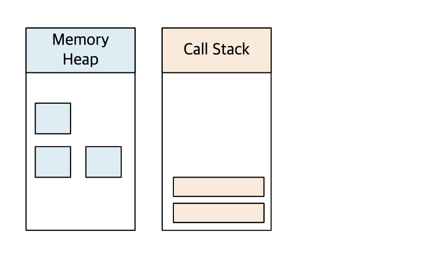
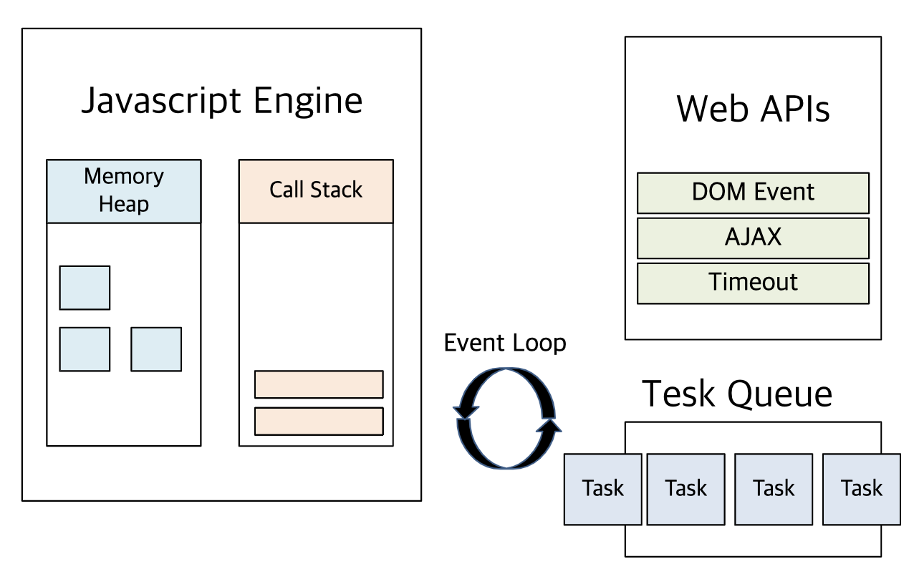
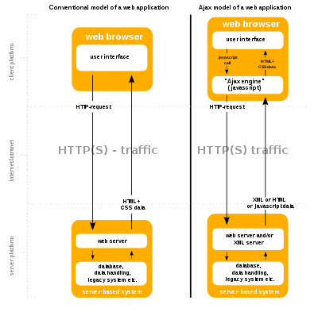

## 글의 내용

이 글은 자바스크립트의 동기 처리와 비동기 처리에 대한 내용과, 비동기 처리 중에서도 HTTP 요청의 비동기 처리를 가능하게 하는 Web API인 XMLHttpRequest 객체에 대해 알아보고 정리한 내용을 담고 있습니다.

## 1. 비동기 처리

자바스크립트는 기본적으로 싱글 스레드 방식으로 동작합니다. 즉, 하나의 실행 컨텍스트 스택만을 가진다는 것을 의미합니다. 함수는 이 실행 컨텍스트 스택에 쌓이게 되고, 스택의 최상위 요소는 실행 중인 실행 컨텍스트에 해당합니다(실행 컨텍스트에 관한 내용은 별도의 포스트로 작성할 예정입니다.). 스택에 쌓여 실행 대기 중인 함수들을 태스크(task)라고 합니다. 태스크는 스택에 최상위 요소인 실행 중인 실행 컨텍스트가 pop되어 제거되면 스택에 쌓인 순서대로 하나씩 실행됩니다. 이렇게 한 번에 하나의 태스크가 실행되는 방식을 싱글 스레드 방식이라고 합니다. 처리 방식의 측면에서 현재 실행중인 태스크가 종료될 때까지 다음에 실행되는 태스크가 대기되기 때문에 동기처리라고도 합니다. 앞서 실행되는 함수의 처리 완료 시간이 오래걸려 그만큼 뒤에 이어지는 태스크들의 처리가 중단되는 것을 블로킹(blocking)이라고 하며 이는 동긱 처리의 단점 중 하나입니다.

  <figure style = "display: block; text-align: center;">
    
    <figcaption style = "text-align: center; font-size: 12px; color: #808080">
    자바스크립트 엔진

<출처 : [Jewoo.Song님 블로그](https://iamsjy17.github.io/javascript/2019/07/20/how-to-works-js.html)>

</figcaption>

  </figure>

이와 같은 동작 방식은 자바스크립트 엔진의 동작 방식입니다. 반면에 브라우저는 멀티 스레드 방식으로 동작합니다. 현재 실행 중인 태스크가 처리가 완료되지 않은 상태에서도 다음 태스크를 실행하는 방식을 말하며, 이를 비동기 처리라고 합니다.

## 2. 이벤트 루프

브라우저의 비동기 처리를 가능하게 하는 것은 브라우저에 내장된 기능 중 하나인 이벤트 루프입니다.

  <figure style = "display: block; text-align: center;">
    
    <figcaption style = "text-align: center; font-size: 12px; color: #808080">
    JavaScript 이벤트 루프

<출처 : [Jewoo.Song님 블로그](https://iamsjy17.github.io/javascript/2019/07/20/how-to-works-js.html)>

</figcaption>

  </figure>

브라우저는 태스크 큐를 통해 자바스크립트 엔진과 이벤트 루프를 형성하며 이를 통해 비동기 처리를 수행합니다(이와 관련해서는 별도의 포스트로 작성할 예정입니다.). 브라우저가 제공하는 Web API는 이러한 비동기 처리를 수행할 수 있는 다양한 함수를 제공합니다. 그 중에서도 HTTP 요청과 관련된 비동기 처리를 가능하게 하는 Web API를 알아보겠습니다.

## 3. Ajax

브라우저가 서버에게 비동기 방식으로 데이터를 요청하고, 이를 통해 서버가 응답한 데이터를 수신해 웹페이지를 동적으로 갱신하는 방식을 Ajax(Asynchronous JavaScript and XML)이라고 합니다. 브라우저가 제공하는 Web API인 XMLHttpRequest 객체를 기반으로 동작하며, XMLHttprequest는 HTTP 비동기 통신을 위한 메서드와 프로퍼티를 제공합니다.

  <figure style = "display: block; text-align: center;">
    
    <figcaption style = "text-align: center; font-size: 12px; color: #808080">
    전통적인 웹 애플리케이션 모델과 Ajax를 사용한 애플리케이션의 비교

<출처 : [Ajax 위키피디아](https://ko.wikipedia.org/wiki/Ajax)>

</figcaption>

  </figure>

전통적인 방식의 웹페이지 렌더링은 변경할 부분이 웹페이지의 일부분이더라도 변경할 필요가 없는 부분까지 포함한 완전한 HTML을 서버로부터 응답받아 렌더링하였습니다. 따라서 불필요한 데이터 통신이 발생하게 되고 서버의 응답이 완료되기 전까지 다음 처리가 블로킹되는 단점이 있었습니다.

반면에 Ajax의 등장으로 서버로부터 웹페이지의 변경이 필요한 부분의 데이터만 비동기 방식으로 응답받아 해당 부분만 한정적으로 렌더링이 가능하게 되었습니다. 불필요한 데이터 통신이 발생하지 않고, 비동기 방식으로 동작하기 때문에 서버에게 요청한 후 블로킹이 발생하지 않습니다.

이러한 클라이언트와 서버 간의 통신은 JSON(JavaScript Object Notation)을 통해 이루어집니다. JSON은 HTTP 통신을 위한 텍스트 데이터 포맷이며, 자바스크립트 외에 대부분의 프로그래밍 언어에서 사용할 수 있는 데이터 포맷입니다.

## 4. XMLHttpRequest

브라우저는 주소창과 HTML의 `<form>`, `<a>` 태그를 통해 HTTP 요청 전송 기능을 제공합니다. 자바스크립트를 사용하여 HTTP 요청을 전송하기 위해서는 브라우저가 제공하는 Web API 중 하나인 XMLHttpRequest 객체를 사용합니다. 해당 객체가 제공하는 메서드를 통해 HTTP 요청을 전송하고 서버로 부터의 응답을 처리합니다.

### 4.1 XMLHttpRequest 객체 생성

Ajax 요청을 보내기 위해서는 XMLHttpRequest 객체를 생성해야합니다. 브라우저에서 제공하는 Web API로 브라우저 환경의 전역 객체인 window의 생성자 함수로 존재합니다.

```js
const xhr = new XMLHttpRequest();
```

### 4.2 HTTP 요청 전송

#### 4.2.1 HTTP 요청 초기화

XMLHttpRequest 객체의 `open` 메서드로 요청을 초기화합니다. 전송할 요청의 종류 및 목적을 첫 번째 인수에 명시하고, 요청을 전송할 URL을 두 번째 인수에 명시해줍니다.

```js
xhr.open('POST, '/signin');
```

#### 4.2.2 HTTP 요청 전송

XMLHttpRequest 객체의 `send` 메서드로 초기화된 HTTP 요청을 서버에 전송합니다.
요청 전송 전에 필요하다면 `setRequestHeader`메서드로 HTTP 요청에 헤더 값을 설정할 수 있습니다. 클라이언트가 서버로 전송할 데이터 MIME 타입을 지정하거나 서버가 응답(accept)할 데이터의 MIME 타입을 지정할 수 있습니다.

```js
// 서버로 전송할 데이터 MIME 타입 설정
xhr.setRequestHeader('content-type', 'application/json');
// xhr.setRequestHeadr('accept', 'application/json');

// HTTP 요청 전송
xhr.send();
```

### 4.3 HTTP 응답 처리

서버가 전송한 HTTP 응답을 처리하기 위해서는 XMLHttpRequest 객체가 제공하는 이벤트 핸들러 프로퍼티를 사용합니다. HTTP 요청의 현재 상태를 나타내는 `readyState` 프로퍼티 값이 변경될 때마다 발생하는 이벤트인 `readystatechange` 이벤트를 캐치하면 HTTP 응답을 처리할 수 있습니다.

`readyState`의 상태는 처음에 `XMLHttpRequest.UNSENT`(보내지 않음)에서, `open` 메서드 호출 후 `XMLHttpRequest.OPENED` 상태로 변경됩니다. `send` 메서드 호출 후에 순차적으로 `XMLHttpRequest.RECEIVED`, `XMLHttpRequest.LOADING`, `XMLHttpRequest.DONE` 상태로 변경됩니다.

```js
xhr.onreadystatechange = () => {
  if (xhr.readyState !== XMLHttpRequest.DONE) return;

  xhr.status === 200
    ? console.log(JSON.parse(xhr.response))
    : console.error('Error', xhr.status, xhr.statusText);
};
```

서버의 응답이 완료되었는지 확인하려면 `readyState` 프로퍼티 값이 `XMLHttpRequest.DONE`인지 확인하면 됩니다.

HTTP 요청에 대한 응답 상태는 `XMLHttpRequest.status`로 확인할 수 있습니다. 정상 처리가 되었다면 200이고 아니라면 에러가 발생한 상태임을 의미합니다. 정상 처리가 되었다면 응답 받은 데이터를 `XMLHttpRequest.response`를 통해 취득할 수 있습니다.

또 다른 응답 처리에 대한 이벤트로 `load` 이벤트가 있습니다. `load` 이벤트는 요청이 성공적으로 완료된 경우 발생하는 이벤트입니다. `readyState` 프로퍼티 값을 확인할 필요가 없으므로 코드가 좀 더 간결해집니다.

```js
xhr.onload = () => {
  xhr.status === 200
    ? console.log(JSON.parse(xhr.response))
    : console.log('Error', xhr.status, xhr.statusText);
};
```

일련의 과정을 정리하면 아래와 같습니다.

```js
// XMLHttpRequest 객체 생성
const xhr = new XMLHttpRequest();

// HTTP 요청 초기화
xhr.open('POST', '/signin');

// HTTP 요청 헤더 설정
xhr.setRequestHeader('content-type', 'application/json');

// HTTP 요청 전송
xhr.send();

// HTTP 응답 처리
xhr.onreadystatechange = () => {
  if (xhr.readyState !== XMLHttpRequest.DONE) return;

  xhr.status === 200
    ? console.log(JSON.parse(xhr.response))
    : console.error('Error', xhr.status, xhr.statusText);
};

// 또는
// xhr.onload = () => {
//   xhr.status === 200 ? console.log(JSON.parse(xhr.response)) : console.log('Error', xhr.status, xhr.statusText);
// };
```

여러가지 예외 사항이 있어 XMLHttpReqeust 관련 라이브러리를 많이 사용하는 편입니다. 또 다른 HTTP 비동기 처리 방식으로 Fetch API를 사용하는 방식이 있습니다. 이와 관련해서는 Promise 관련 포스트에서 다뤄보도록 하겠습니다.

## 참고

- 모던 자바스크립트 Deep dive

- [Jewoo.Song님 블로그](https://iamsjy17.github.io/javascript/2019/07/20/how-to-works-js.html)

- [Ajax 위키피디아](https://ko.wikipedia.org/wiki/Ajax)
